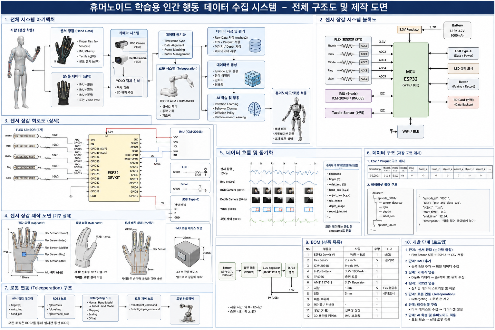

# 휴머노이드 학습용 인간 행동 데이터 수집 시스템

사람의 손·팔 움직임과 작업 환경을 센서 장갑, IMU, RGB/Depth 카메라로 측정하고,
시간 동기화를 거쳐 로봇 학습용 데이터셋으로 만드는 전체 시스템 설계 프로젝트입니다.

> 이 저장소의 제작 도면은 **개념 설계 및 교육용 초안**입니다.
> 실제 제작 전에는 사용하려는 ESP32 보드, Flex Sensor, IMU, 배터리, 레귤레이터의
> 데이터시트와 전압/전류/GPIO/ADC 조건을 반드시 다시 확인하세요.

## 전체 제작 도면



---

## 1. 전체 시스템 아키텍처

전체 흐름은 다음과 같습니다.

```text
사람의 행동
  ↓
센서 장갑 / 팔·몸 데이터 / RGB·Depth 카메라
  ↓
YOLO 객체 인식 + 3D 위치 추정
  ↓
데이터 동기화
  ↓
ROS2 / Teleoperation
  ↓
Raw Data 저장
  ↓
Episode 단위 데이터셋 생성
  ↓
Imitation Learning / Behavior Cloning / Diffusion Policy / RL
  ↓
로봇팔 또는 휴머노이드 적용
```

센서 장갑은 손가락 굽힘과 손목 자세를 담당하고, 카메라는 손과 물체의 공간 위치 및 장면을 담당합니다.
각 센서는 서로 다른 종류의 정보를 제공하므로 하나의 센서만 사용하는 것보다 훨씬 풍부한 인간 행동 데이터를 만들 수 있습니다.

## 2. 센서 장갑 시스템 블록도

기본 구성:

- Flex Sensor 5개: 엄지, 검지, 중지, 약지, 소지 굽힘 측정
- IMU: 손등/손목 방향 및 회전 측정
- Tactile Sensor(선택): 접촉/압력 측정
- ESP32: 센서 취득, 전처리, 통신
- USB Type-C: 데이터/전원
- Wi-Fi/BLE: 무선 전송
- LED/Button: 상태 표시 및 녹화/페어링
- SD Card(선택): 로컬 백업
- Li-Po 배터리: 무선 장갑 전원

핵심 데이터:

```text
finger[5]
wrist_imu
hand_pose
tactile(optional)
timestamp
```

## 3. 센서 장갑 회로도

Flex Sensor는 손가락이 굽어질 때 저항이 변합니다.
ESP32는 보통 전압 분배 회로의 출력 전압을 ADC로 읽습니다.

개념 회로:

```text
3.3V
 │
[Flex Sensor]
 │
 ├──── ADC 입력
 │
[고정 저항]
 │
GND
```

IMU는 보통 I2C로 연결합니다.

```text
ESP32      IMU
3.3V  ───  VCC
GND   ───  GND
SDA   ───  SDA
SCL   ───  SCL
```

실제 사용 핀은 보드와 펌웨어 구성에 따라 달라질 수 있으므로 반드시 데이터시트를 확인하세요.

## 4. 센서 장갑 제작 도면

제작 시 고려할 점:

- Flex Sensor는 손가락 등 쪽에 배치
- IMU는 손등 또는 손목의 비교적 단단한 위치에 장착
- 전선은 손가락 움직임을 방해하지 않도록 손등 쪽으로 모아서 배선
- ESP32/배터리는 손목 또는 별도 소형 케이스에 배치
- 센서 교체를 고려해 벨크로/슬리브/탈착 구조 권장
- 장갑은 너무 두껍지 않은 신축성 소재가 유리

## 5. 데이터 흐름 및 동기화

각 장치의 주기는 서로 다를 수 있습니다.

예:

```text
Glove/IMU       100 Hz
RGB Camera       30 Hz
Depth Camera     30 Hz
YOLO             30 Hz
Robot State      50 Hz
```

따라서 모든 데이터에 공통 timestamp를 부여하고 시간축에 맞춰 정렬해야 합니다.

동기화된 한 시점의 예:

```text
timestamp
finger[5]
wrist_imu
hand_pos[x,y,z]
object_pos[x,y,z]
rgb_image
depth_image
robot_joint[n]
```

## 6. 데이터 구조

### CSV/Parquet 예시

```csv
timestamp,thumb,index,middle,ring,little,hand_x,hand_y,hand_z,object_x,object_y,object_z
10.0001,0.02,0.03,0.03,0.02,0.02,0.42,0.18,0.63,0.55,0.16,0.71
```

### Episode 구조 예시

```text
dataset/
├── episode_0001/
│   ├── sensor_data.csv
│   ├── rgb/
│   ├── depth/
│   └── label.json
├── episode_0002/
└── ...
```

### label.json 예시

```json
{
  "episode_id": "0001",
  "task": "pick_and_place_cup",
  "object": "cup",
  "start_time": 0.0,
  "end_time": 12.34,
  "description": "컵을 집어 테이블에 놓기"
}
```

## 7. 로봇 연동(Teleoperation)

ROS2 기준 예시:

```text
센서 장갑 드라이버
  ↓
/glove/data
/glove/imu
/glove/hand_pose
  ↓
Retargeting Node
  ↓
/robot/joint_command
/robot/gripper_command
  ↓
Robot Controller
  ↓
Robot Arm / Humanoid
```

사람과 로봇의 관절 구조가 다르기 때문에 Retargeting 단계가 필요합니다.

대표적인 변환 과정:

```text
Human Hand Motion
  ↓
Normalization
  ↓
Coordinate Transform
  ↓
Retargeting
  ↓
Inverse Kinematics
  ↓
Robot Joint Command
```

## 8. 전원 및 통신 구성

개념 구성:

```text
Li-Po Battery
  ↓
충전 모듈
  ↓
3.3V Regulator
  ↓
ESP32 + Sensors
```

통신은 다음 중 하나를 선택할 수 있습니다.

- USB: 가장 간단하고 안정적
- Wi-Fi: 고속 무선 데이터 전송에 유리
- BLE: 저전력, 비교적 간단한 무선 장갑에 유리

초기 개발은 USB 유선 방식으로 시작하고, 안정화 이후 무선으로 확장하는 것을 권장합니다.

## 9. BOM(부품 목록)

| No. | 부품 | 용도 | 수량 |
|---:|---|---|---:|
| 1 | ESP32 DevKit | MCU / Wi-Fi / BLE | 1 |
| 2 | Flex Sensor | 손가락 굽힘 측정 | 5 |
| 3 | IMU (예: ICM-20948/BNO085 계열) | 손목 자세 측정 | 1 |
| 4 | Li-Po Battery | 전원 | 1 |
| 5 | USB Type-C 케이블/모듈 | 데이터/전원 | 1 |
| 6 | 3.3V Regulator | 전원 안정화 | 1 |
| 7 | 고정 저항 | Flex Sensor 전압 분배 | 5 |
| 8 | LED | 상태 표시 | 1 |
| 9 | Button | Pairing / Record | 1 |
| 10 | 케이블/커넥터 | 배선 | 필요량 |
| 11 | 신축성 장갑 | 센서 장착 | 1 |
| 12 | 3D 프린팅 케이스 | MCU/IMU 보호 | 1 |

## 10. 개발 단계 로드맵

### 1단계 — 센서 장갑 최소 구성
Flex Sensor 1개를 ESP32에 연결하고 PC에서 실시간 값을 확인합니다.

### 2단계 — 손가락 5개 + IMU
다섯 손가락과 손목 자세를 동시에 취득합니다.

### 3단계 — 카메라 연동
RGB/Depth 카메라에서 손과 물체의 3D 위치를 취득합니다.

### 4단계 — ROS2 연동
센서, 카메라, 로봇 데이터를 ROS2 topic으로 통합합니다.

### 5단계 — Teleoperation
사람의 움직임을 Retargeting하여 로봇팔/그리퍼를 실시간 제어합니다.

### 6단계 — Dataset 구축
하나의 작업을 하나의 Episode로 저장하고 수십~수백 회 반복 수집합니다.

### 7단계 — AI 학습
Imitation Learning, Behavior Cloning, Diffusion Policy 등으로 실제 로봇 동작을 학습합니다.

---

## 프로젝트의 핵심

이 프로젝트의 목표는 단순한 센서 장갑 제작이 아닙니다.

**사람이 무엇을 보고, 손과 팔을 어떻게 움직였으며, 어떤 물체와 어떻게 상호작용했는지를
시간축에 맞춰 기록하여 로봇이 학습할 수 있는 데이터로 만드는 것**이 핵심입니다.

```text
Human Action
  ↓
Sensing
  ↓
Synchronization
  ↓
Dataset
  ↓
Retargeting
  ↓
Robot Learning
  ↓
Humanoid Task Execution
```

## 다음 개발 목표

첫 번째 실제 구현 목표는 아래처럼 작게 잡는 것이 좋습니다.

> ESP32 + Flex Sensor 1개로 검지 굽힘 데이터를 읽어 PC에 저장한다.

이것이 성공하면 5개 손가락, IMU, Depth Camera, ROS2, 로봇팔 순서로 확장합니다.
