# Depth Camera + ROBOTIS OMX 로봇팔 자동 Pick & Place

## YOLO 객체 인식부터 3D 좌표 계산, 로봇 좌표 변환, OMX 제어까지

---

## 머리말

이 책은 Depth Camera와 ROBOTIS OMX 로봇팔을 이용하여 물체를 인식하고, 물체의 3차원 위치를 계산하고, 카메라 좌표를 로봇 좌표로 변환한 뒤, 실제 로봇팔이 물체를 집어서 원하는 위치에 내려놓는 **자동 Pick & Place 시스템**의 전체 구조를 이해하기 위한 입문·실습용 문서입니다.

핵심은 단순히 “로봇팔을 움직인다”가 아닙니다.

카메라가 본 영상이 어떻게 숫자로 바뀌고, 그 숫자가 어떻게 로봇의 관절 움직임으로 바뀌는지를 하나의 데이터 흐름으로 이해하는 것이 목표입니다.

전체 흐름은 다음과 같습니다.

> **Depth Camera → YOLO 객체 검출 → 3D 좌표 계산 → 로봇 좌표 변환 → OMX 로봇팔 제어 → Pick & Place**

---

# 1장. 전체 시스템 개요

전체 시스템은 크게 6단계로 구성됩니다.

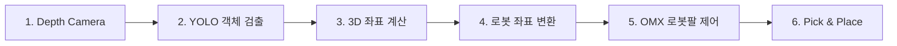

한 문장으로 정리하면 다음과 같습니다.

> **카메라로 본다 → 물체를 찾는다 → 3차원 위치를 계산한다 → 로봇 좌표로 바꾼다 → 로봇팔을 움직인다 → 물체를 집어서 옮긴다.**

이 구조에는 컴퓨터 비전, 인공지능, 3차원 기하학, 좌표 변환, 로봇 기구학, ROS 2 제어가 모두 연결됩니다.

---

# 2장. 1단계 — Depth Camera

## 2.1 Depth Camera란?

일반 RGB 카메라는 색상과 형태를 봅니다.

Depth Camera는 여기에 **거리 정보**를 추가로 제공합니다.

즉, 각 픽셀마다 카메라로부터 얼마나 떨어져 있는지를 알 수 있습니다.

- RGB 영상: “무엇이 보이는가?”
- Depth 영상: “얼마나 떨어져 있는가?”

그래서 Depth Camera는 로봇에게 **공간을 보는 눈** 역할을 합니다.

## 2.2 데이터 흐름

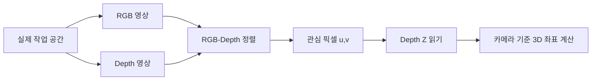

## 2.3 RGB와 Depth 정렬

RGB 영상에서 컵 중심이 `(u, v)`라고 하더라도 Depth 영상의 같은 픽셀이 실제 컵을 가리키지 않으면 잘못된 거리값을 읽게 됩니다.

따라서 RGB 영상과 Depth 영상이 같은 물리적 지점을 가리키도록 맞추는 **Alignment** 과정이 중요합니다.

## 2.4 Depth 값의 안정성

Depth 값은 다음과 같은 상황에서 흔들릴 수 있습니다.

- 반사되는 물체
- 투명한 물체
- 물체의 가장자리
- 너무 가까운 거리
- 너무 먼 거리
- 센서 노이즈

실전에서는 한 픽셀만 사용하는 대신 중심 주변의 작은 영역에서 여러 Depth 값을 읽고 **중앙값(median)** 또는 유효값 평균을 사용하는 것이 안정적입니다.

---

# 3장. 2단계 — YOLO 객체 검출

## 3.1 YOLO의 역할

YOLO는 RGB 영상에서 물체를 찾아냅니다.

예를 들어 컵이 들어오면 다음 정보를 얻을 수 있습니다.

- 클래스(Class): `cup`
- 신뢰도(Confidence)
- 바운딩 박스(Bounding Box)
- 중심 픽셀 `(u, v)`

YOLO가 하는 일은 단순히 “컵이 있다”라고 판단하는 것이 아닙니다.

로봇이 사용할 수 있도록 **컵이 화면의 어디에 있는지**까지 알려줍니다.

## 3.2 데이터 흐름

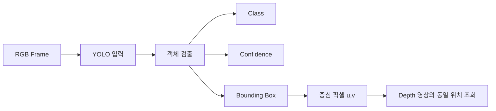

## 3.3 Bounding Box 중심

바운딩 박스가 다음 좌표로 표현된다고 해보겠습니다.

- 왼쪽 위: `(x1, y1)`
- 오른쪽 아래: `(x2, y2)`

중심점은 다음처럼 계산할 수 있습니다.

\[
u = \frac{x_1+x_2}{2}
\]

\[
v = \frac{y_1+y_2}{2}
\]

이 `(u, v)`는 아직 2차원 픽셀 좌표입니다.

다음 단계에서 Depth 값과 결합해 3차원 위치로 바뀝니다.

---

# 4장. 3단계 — 3D 좌표 계산

## 4.1 왜 3D 좌표가 필요한가?

YOLO가 물체의 중심 픽셀을 알려줘도 로봇은 움직일 수 없습니다.

예를 들어 `(420, 265)`라는 값은 화면 안의 위치일 뿐 실제 공간의 위치가 아닙니다.

그래서 다음 정보가 필요합니다.

- 픽셀 좌표 `(u, v)`
- Depth 거리 `Z`
- 카메라 내부 파라미터 `fx, fy, cx, cy`

## 4.2 카메라 내부 파라미터

- `fx`: X 방향 초점 관련 값
- `fy`: Y 방향 초점 관련 값
- `cx`: 영상 광학 중심 X
- `cy`: 영상 광학 중심 Y

## 4.3 2D 픽셀 → 3D 좌표

카메라 기준 3D 좌표는 다음 식으로 계산할 수 있습니다.

\[
X_c = \frac{(u-c_x)Z}{f_x}
\]

\[
Y_c = \frac{(v-c_y)Z}{f_y}
\]

\[
Z_c = Z
\]

예를 들어,

- 중심 픽셀: `(420, 265)`
- Depth: `580 mm`

라고 했을 때 계산 결과가 예시로 다음처럼 나올 수 있습니다.

```text
Camera XYZ
Xc = 82 mm
Yc = 31 mm
Zc = 580 mm
```

이 값은 **카메라 기준 좌표**입니다.

## 4.4 ROS optical frame

ROS에서 자주 사용하는 optical frame convention은 일반적으로 다음과 같습니다.

- +X: 오른쪽
- +Y: 아래쪽
- +Z: 카메라가 바라보는 전방

실제 구현에서는 사용하는 카메라 드라이버와 TF 좌표축 정의를 반드시 확인해야 합니다.

## 4.5 데이터 흐름

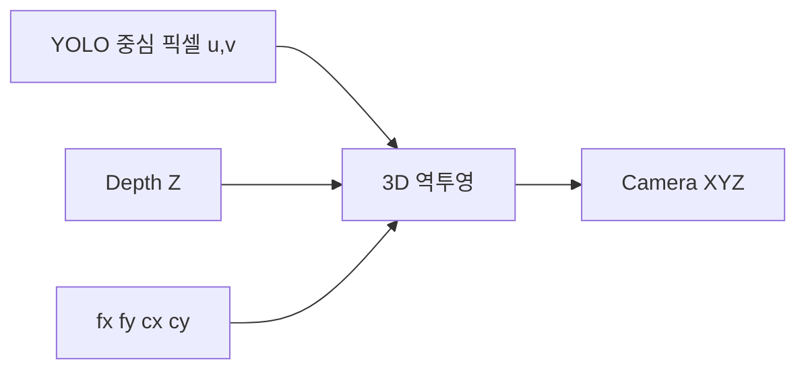

---

# 5장. 4단계 — 카메라 좌표를 로봇 좌표로 변환

## 5.1 왜 좌표 변환이 필요한가?

카메라가 계산한 `(Xc, Yc, Zc)`는 카메라 기준입니다.

하지만 OMX 로봇팔은 자신의 `base_link`를 기준으로 움직입니다.

따라서 카메라의 좌표를 로봇이 이해할 수 있는 좌표로 바꿔야 합니다.

## 5.2 이동과 회전

카메라와 로봇 사이에는 두 종류의 차이가 있습니다.

1. Translation — 위치 차이
2. Rotation — 방향 차이

이 두 관계를 합쳐 하나의 변환 행렬로 나타냅니다.

\[
P_{robot} = T_{robot \leftarrow camera} P_{camera}
\]

개념적으로는 다음과 같습니다.

```text
Camera XYZ
   ↓
카메라-로봇 위치 관계
   ↓
카메라-로봇 방향 관계
   ↓
Transformation
   ↓
Robot Base XYZ
```

## 5.3 예시

카메라에서 측정된 좌표:

```text
(Xc, Yc, Zc) = (82, 31, 580) mm
```

좌표 변환 후 예시:

```text
(Xr, Yr, Zr) = (220, 60, 85) mm
```

이 숫자는 원리를 설명하기 위한 예시입니다. 실제 값은 카메라 설치 위치와 캘리브레이션 결과에 따라 달라집니다.

## 5.4 캘리브레이션

좌표 변환을 정확하게 하려면 캘리브레이션이 필요합니다.

카메라와 로봇 사이의 상대적인 위치와 방향을 알아내는 과정입니다.

카메라가 로봇 외부에 고정되어 로봇을 바라보는 구조는 일반적으로 **Eye-to-Hand** 방식으로 구성할 수 있습니다.

카메라가 로봇의 손목이나 엔드이펙터에 장착되어 있다면 **Eye-in-Hand** 구조입니다.

## 5.5 ROS 2 TF

ROS 2에서는 다음과 같은 TF 관계로 관리할 수 있습니다.

```text
base_link
   ↑
camera_link
   ↑
camera_optical_frame
```

실제 시스템에서는 TF 트리를 올바르게 구성하는 것이 매우 중요합니다.

---

# 6장. 5단계 — OMX 로봇팔 제어

## 6.1 목표 좌표에서 관절 움직임으로

좌표 변환을 끝내면 물체 위치는 OMX `base_link` 기준 XYZ가 됩니다.

하지만 로봇 모터는 XYZ를 직접 이해하지 못합니다.

OMX는 관절을 회전시켜 움직입니다.

따라서 XYZ 목표점을 관절각으로 바꾸는 **역기구학(Inverse Kinematics, IK)** 과정이 필요합니다.

## 6.2 전체 데이터 흐름

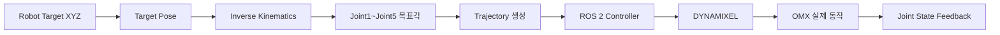

## 6.3 역기구학

역기구학의 질문은 다음과 같습니다.

> “로봇 손끝을 이 위치로 보내려면 각각의 관절을 몇 도 움직여야 하는가?”

결과는 다음과 같은 형태가 됩니다.

```text
joint1 = ...
joint2 = ...
joint3 = ...
joint4 = ...
joint5 = ...
```

## 6.4 안전한 접근점

실제 Pick 작업에서는 목표 물체 위치로 바로 이동하지 않는 것이 좋습니다.

예를 들어 Pick 지점이 다음이라면,

```text
Pick Point
X = 220 mm
Y = 60 mm
Z = 85 mm
```

먼저 위쪽의 Approach Point로 이동할 수 있습니다.

```text
Approach Point
X = 220 mm
Y = 60 mm
Z = 135 mm
```

그다음 천천히 아래로 내려갑니다.

## 6.5 ROS 2 제어

OMX 로봇팔 제어에서는 일반적으로 다음 요소가 연결됩니다.

- Joint trajectory
- Arm controller
- Gripper controller
- Joint state feedback
- DYNAMIXEL motor

관절을 한 번에 목표 각도로 튀게 만드는 대신 시간 정보를 가진 trajectory를 사용하면 더 부드럽게 움직일 수 있습니다.

---

# 7장. 6단계 — Pick & Place

## 7.1 Pick 동작

Pick은 다음 순서로 진행됩니다.

```text
Home
 ↓
Approach
 ↓
Gripper Open
 ↓
Descend
 ↓
Gripper Close
 ↓
Lift
```

먼저 물체 위쪽 안전 위치로 접근합니다.

그리퍼를 열고 천천히 내려갑니다.

물체를 잡을 위치에 도착하면 그리퍼를 닫습니다.

그다음 물체를 위쪽으로 들어 올립니다.

## 7.2 Place 동작

Place는 다음 순서입니다.

```text
Move to Place Approach
 ↓
Descend
 ↓
Gripper Open
 ↓
Lift
 ↓
Home
```

물체를 목적지 위쪽으로 이동한 뒤 천천히 내려가고, 그리퍼를 열어서 물체를 놓습니다.

그다음 다시 위로 올라간 뒤 Home 자세로 복귀합니다.

## 7.3 전체 Pick & Place State Flow

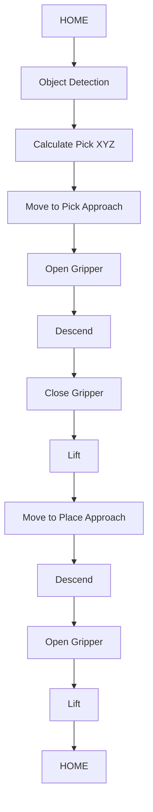

---

# 8장. 전체 데이터 흐름 다시 보기

이제 1단계부터 6단계까지 한 번에 연결해 보겠습니다.

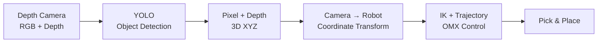

데이터의 형태도 계속 바뀝니다.

```text
실제 물체
  ↓
RGB 이미지
  ↓
YOLO Bounding Box
  ↓
중심 픽셀 (u,v)
  ↓
Depth Z
  ↓
Camera XYZ
  ↓
Robot XYZ
  ↓
Joint Angles
  ↓
Motor Command
  ↓
Robot Motion
```

이 흐름을 이해하면 카메라의 영상 정보가 어떻게 실제 로봇의 움직임으로 변하는지 전체 구조를 이해할 수 있습니다.

---

# 9장. ROS 2 관점의 시스템 구조

하드웨어와 소프트웨어를 ROS 2 관점으로 보면 다음과 같은 구조를 만들 수 있습니다.

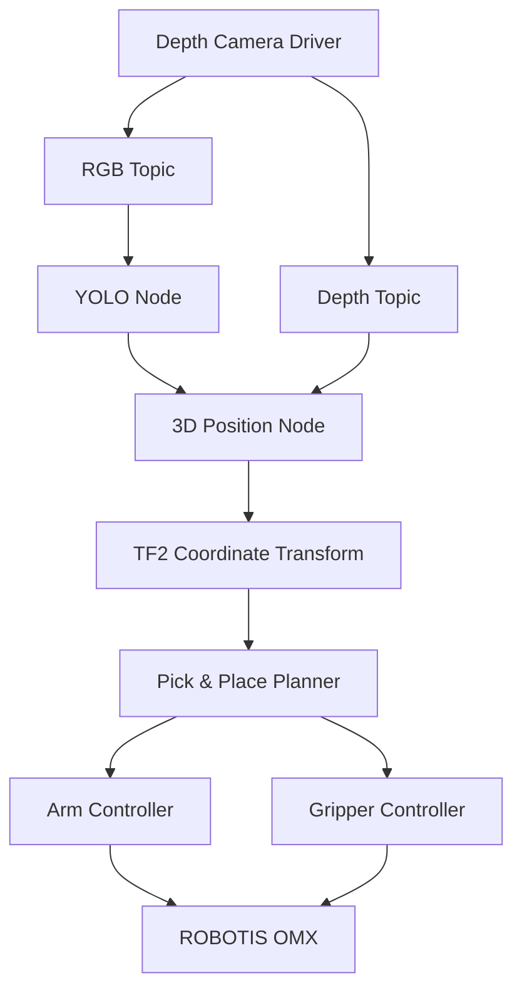

실제 패키지 이름과 토픽 이름은 설치 환경과 구현 방식에 따라 달라질 수 있습니다.

---

# 10장. 실제 구현 순서

처음부터 모든 것을 한 번에 연결하면 디버깅이 매우 어렵습니다.

다음 순서로 하나씩 검증하는 것이 좋습니다.

1. RGB 영상 정상 출력 확인
2. Depth 영상 정상 출력 확인
3. YOLO 객체 검출 확인
4. 중심 픽셀 `(u,v)` 출력
5. 해당 위치 Depth 출력
6. Camera XYZ 계산
7. Camera XYZ 안정성 테스트
8. 카메라 ↔ 로봇 캘리브레이션
9. Robot XYZ 변환 결과 확인
10. OMX 목표 XYZ 이동 테스트
11. Approach / Descend 동작 테스트
12. Gripper Open / Close 테스트
13. Pick 단독 테스트
14. Place 단독 테스트
15. 전체 Pick & Place 연결
16. 반복 동작 및 오류 처리

---

# 11장. 자주 발생하는 오류

## Depth 값이 튄다

원인:
- 반사
- 투명 물체
- 물체 가장자리
- 잘못된 RGB-Depth 정렬

해결:
- 작은 ROI 사용
- 중앙값 적용
- 유효 Depth 필터링

## 로봇이 엉뚱한 방향으로 움직인다

원인:
- X/Y/Z 축 방향 불일치
- mm와 m 단위 혼용
- TF 방향 반대
- 회전 행렬 오류

해결:
- 좌표축을 실제로 하나씩 검증
- 변환 전후 테스트 포인트 기록
- 단위 통일

## 로봇이 목표물 위가 아닌 옆으로 간다

원인:
- 캘리브레이션 오차
- 카메라 고정 불량
- Depth 노이즈
- Bounding Box 중심과 실제 잡기점 차이

해결:
- 다점 캘리브레이션
- Pick offset 적용
- 물체별 grasp point 정의

## 물체를 잡을 때 충돌한다

원인:
- 목표점으로 바로 이동
- Approach Point 없음
- Z 높이 오차

해결:
- 항상 Approach → Descend 순서 사용
- 처음에는 느린 속도로 테스트
- 테이블 안전 높이 제한

---

# 12장. 이 시스템을 확장하면

이 구조는 컵 하나를 옮기는 실험에서 끝나지 않습니다.

다음과 같은 시스템으로 확장할 수 있습니다.

- 컨베이어 자동 분류
- 물류 Pick & Place
- 비전 기반 조립
- 빈 피킹(Bin Picking)
- 재활용품 분류
- 서비스 로봇
- 모바일 매니퓰레이터
- 휴머노이드 조작
- 로봇 학습 데이터 수집
- Physical AI

즉, 이번 실습은 로봇이 **보고 → 이해하고 → 위치를 계산하고 → 행동하는 구조**를 배우는 기초입니다.

---

# 13장. 영상용 최종 요약

오늘 공부한 전체 시스템은 다음과 같습니다.

**첫 번째**, Depth Camera가 RGB 영상과 거리 정보를 얻습니다.

**두 번째**, YOLO가 물체의 종류와 위치를 찾아냅니다.

**세 번째**, 픽셀 좌표와 Depth를 이용해 카메라 기준 3차원 XYZ를 계산합니다.

**네 번째**, 캘리브레이션과 좌표 변환을 통해 Camera XYZ를 OMX `base_link` 기준 XYZ로 바꿉니다.

**다섯 번째**, 목표 XYZ를 역기구학으로 관절각으로 변환하고 ROS 2를 통해 OMX 로봇팔을 제어합니다.

**여섯 번째**, Approach, Gripper, Descend, Pick, Lift, Move, Place, Home 순서로 전체 자동화 동작을 완성합니다.

한 줄로 정리하면:

> **카메라로 본다 → AI가 물체를 찾는다 → 3D 위치를 계산한다 → 로봇 좌표로 변환한다 → OMX가 움직인다 → 물체를 집어서 옮긴다.**

---

# 맺음말

Depth Camera 기반 Pick & Place 시스템을 공부하면 단순한 로봇팔 제어를 넘어 **시각 인식과 실제 물리적 행동이 어떻게 연결되는지** 이해할 수 있습니다.

이것이 로봇 비전과 Physical AI를 공부할 때 매우 중요한 기본 구조입니다.

앞으로는 이 설계를 실제 ROS 2 코드로 하나씩 구현하면서 다음 단계로 발전시킬 수 있습니다.

- 실시간 YOLO
- 실시간 Depth XYZ
- TF2 좌표 변환
- OMX IK
- 자동 Pick
- 자동 Place
- 반복 작업
- 컨베이어 연동

---

## 부록 A. 핵심 공식

### Pixel + Depth → Camera XYZ

\[
X_c = \frac{(u-c_x)Z}{f_x}
\]

\[
Y_c = \frac{(v-c_y)Z}{f_y}
\]

\[
Z_c = Z
\]

### Camera → Robot

\[
P_{robot} = T_{robot \leftarrow camera} P_{camera}
\]

---

## 부록 B. 핵심 용어

| 용어 | 의미 |
|---|---|
| RGB | 컬러 영상 |
| Depth | 카메라에서 물체까지의 거리 |
| YOLO | 실시간 객체 검출 모델 계열 |
| Bounding Box | 물체를 둘러싼 사각형 영역 |
| Pixel `(u,v)` | 영상상의 2D 위치 |
| Camera Intrinsics | 카메라 내부 파라미터 |
| Camera XYZ | 카메라 기준 3D 위치 |
| Robot XYZ | 로봇 베이스 기준 3D 위치 |
| Calibration | 카메라와 로봇 좌표 관계 보정 |
| TF / TF2 | ROS 좌표계 변환 시스템 |
| IK | 목표 자세에서 관절각을 계산하는 역기구학 |
| Trajectory | 시간에 따른 로봇 이동 경로 |
| Pick | 물체를 집는 동작 |
| Place | 물체를 내려놓는 동작 |
| Approach Point | 물체에 접근하기 위한 안전 지점 |

---

## 부록 C. 이미지 넣기

이 책에서 사용한 상세 도면 이미지를 GitHub 폴더의 `images/` 폴더에 넣고 다음 형식으로 삽입할 수 있습니다.

```markdown
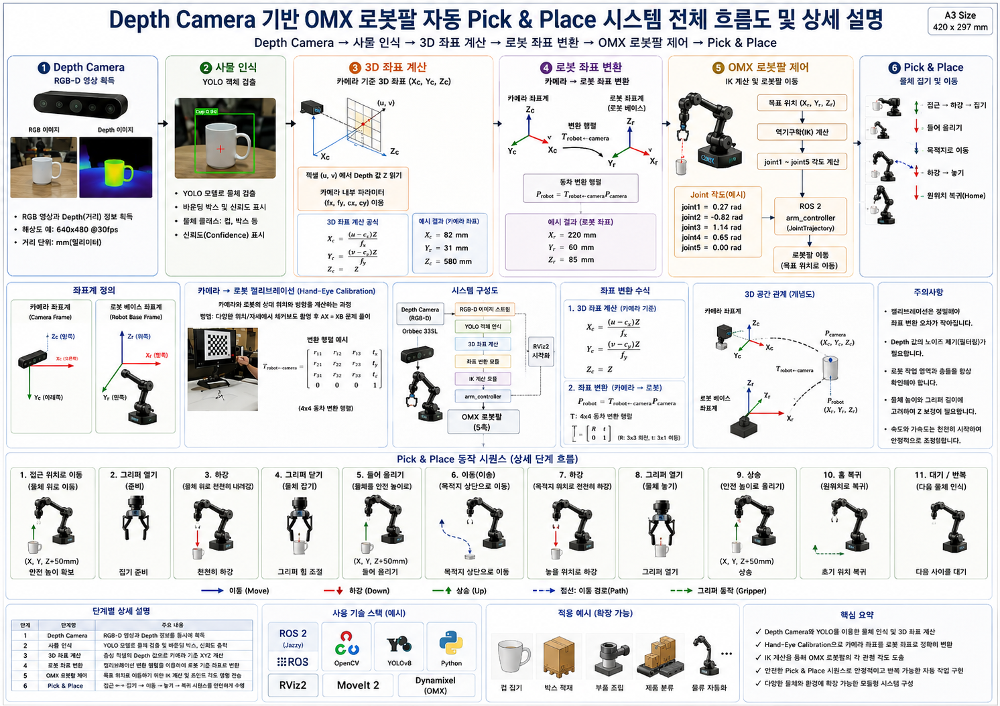
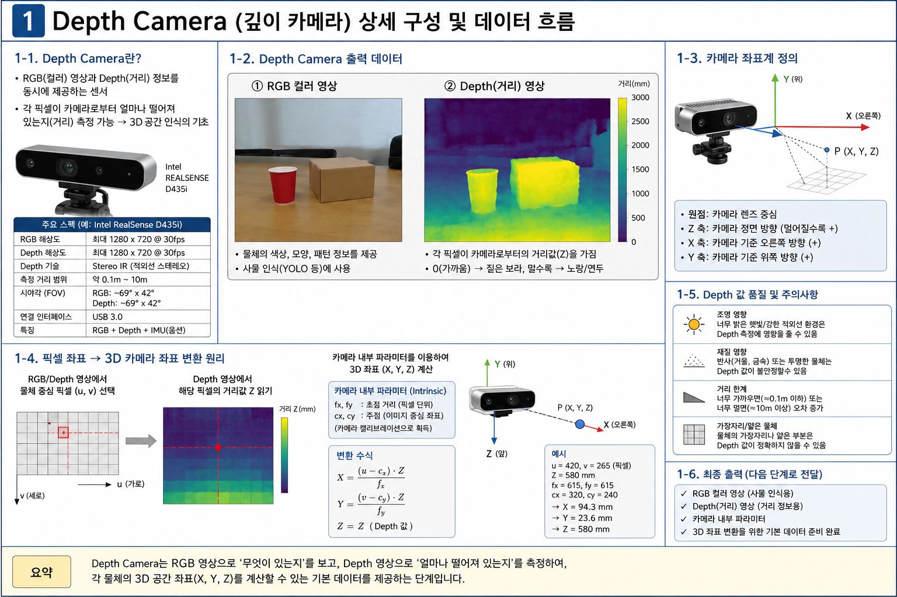
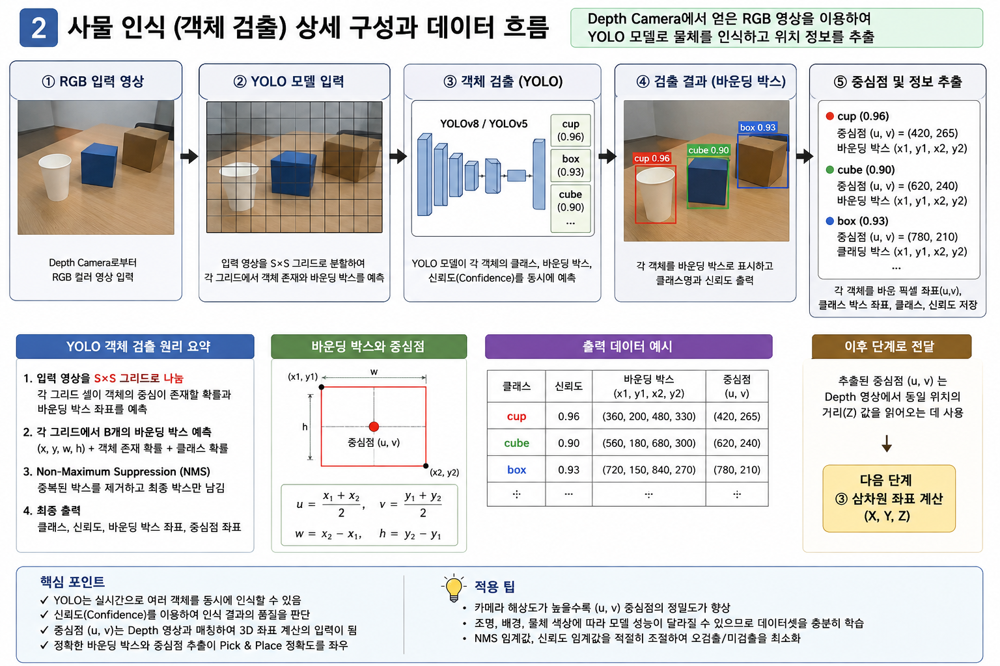
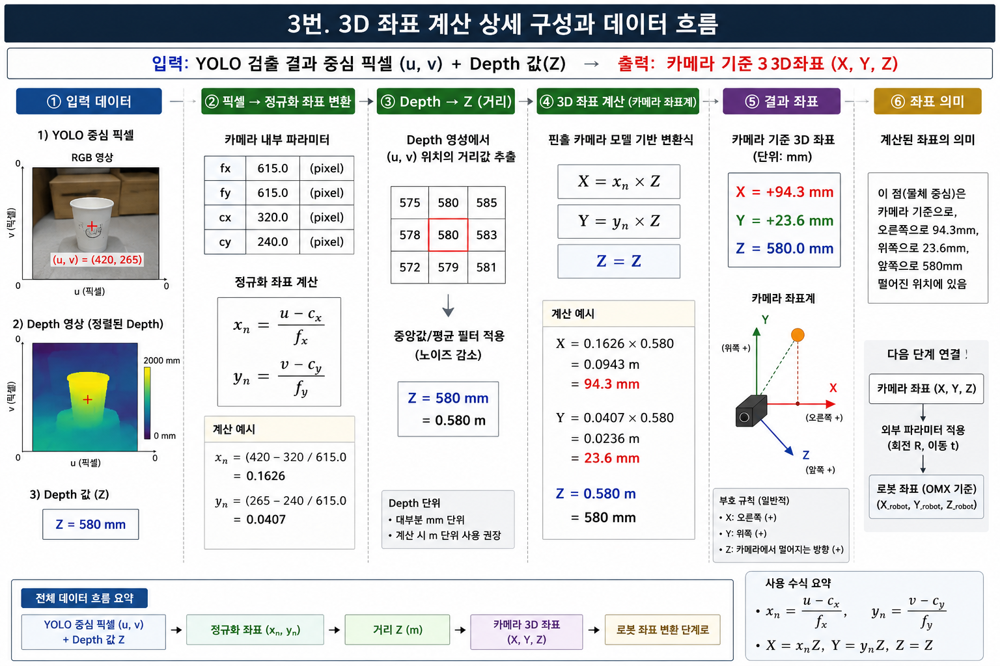
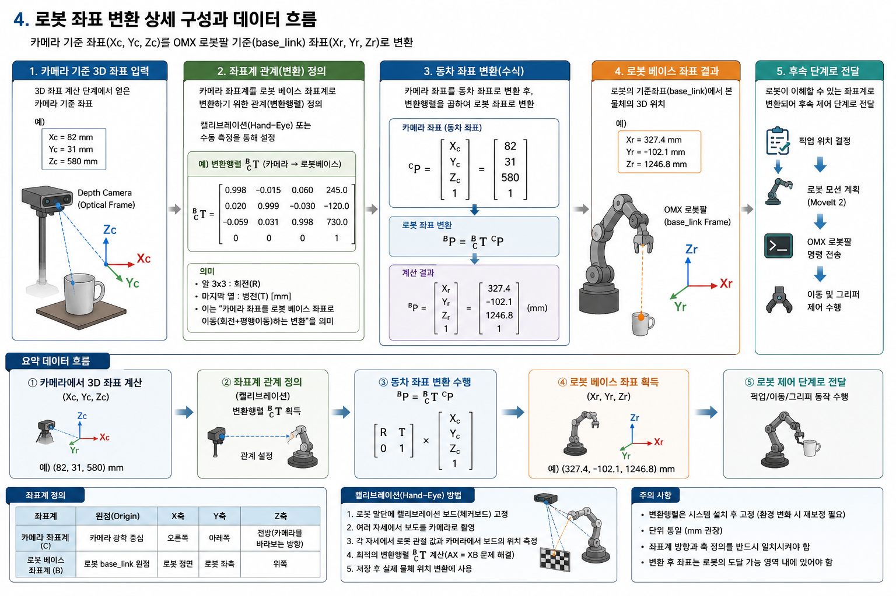
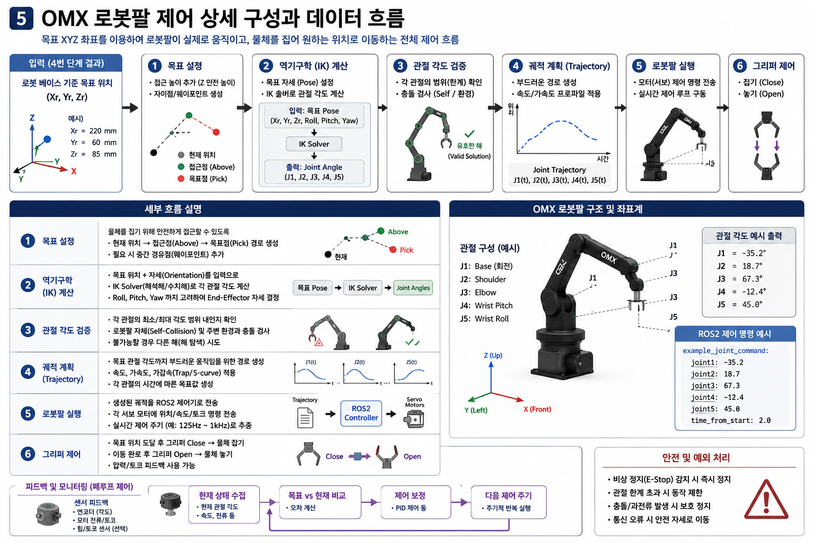
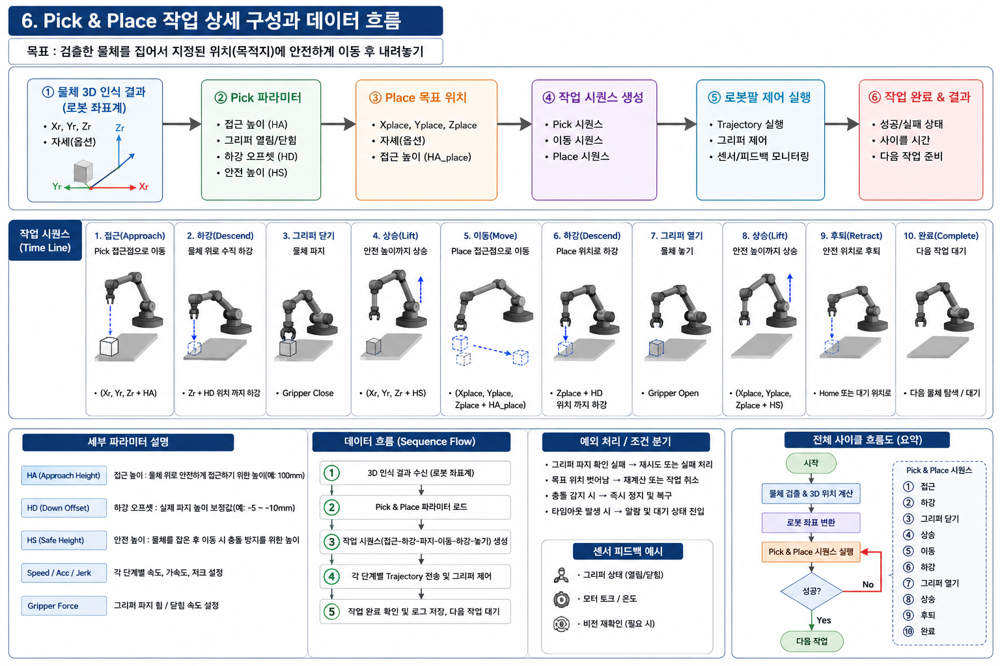
```

