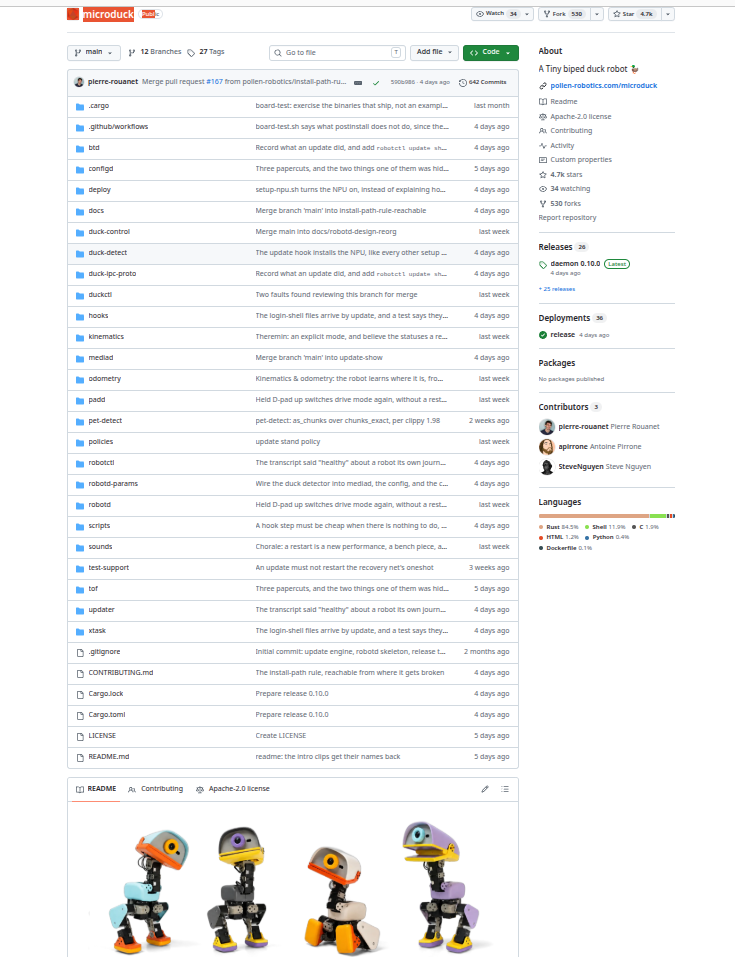

# 사진 한 장에서 로봇 설계까지

## ChatGPT와 함께 탐구하는 MicroDuck 구조·제어·오픈소스 제작 아이디어

> **중요 안내**  
> 이 자료는 MicroDuck의 공식 기구 설계도나 복제 제작 매뉴얼이 아닙니다. 사진·영상에서 관찰한 특징, 공개된 자료, 일반적인 로봇공학 원리를 바탕으로 구조와 제작 가능성을 탐구한 교육용 사례 연구입니다. 치수·부품 배치 등 추정 정보는 실물 제작 전에 반드시 공식 자료와 실측으로 검증해야 합니다.

## 프로젝트 한눈에 보기

사진·영상 → 구조 관찰 → ChatGPT 추론 → 추정 설계도 → GitHub/공식 자료 확인 → 사실과 추정 구분 → 수정 설계 → 나만의 제작 아이디어

## 1. 왜 MicroDuck을 살펴보았나

요즘 눈에 띄는 작은 로봇을 보면서 출발한 질문은 단순했습니다. “이 로봇은 어떻게 만들었을까?” 걷고, 바퀴를 이용해 이동하고, 물건을 다루고, 넘어져도 다시 일어나는 모습을 보면 장난감처럼 보이지만 그 안에는 기구 설계, 액추에이터, 센서, 임베디드 컴퓨터, 제어 소프트웨어와 학습된 동작이 함께 들어 있습니다.

이번 작업의 목적은 MicroDuck을 그대로 복제하는 것이 아닙니다. 사진이나 영상에서 흥미로운 로봇을 발견했을 때 그 장면을 캡처하고, ChatGPT와 함께 구조를 추론하고, 공개 자료를 찾아 사실과 추정을 구분하면서 ‘내가 비슷한 기능의 로봇을 만든다면 어떻게 접근할까?’라는 제작 아이디어로 발전시키는 과정을 보여주는 것입니다.

## 2. 사진을 어떻게 설계 아이디어로 바꾸는가

사진을 보면 처음에는 외형만 보입니다. 하지만 제작 관점으로 보기 시작하면 선이 하나씩 보이기 시작합니다. 몸체의 경계는 프레임과 커버로, 둥근 축은 관절로, 관절 사이의 형상은 링크로, 반복되는 회전부는 모터가 들어갈 자리로 해석할 수 있습니다.

ChatGPT가 추정 설계도를 만들 때의 기준은 세 가지입니다. 첫째, 이미지에서 실제로 관찰되는 형상과 비율입니다. 둘째, 공개 문서나 저장소에서 확인할 수 있는 사양과 소프트웨어 정보입니다. 셋째, 일반적인 로봇 설계 원리입니다. 사진이 단서를 주고, 공개 자료가 기준점을 주며, 로봇공학 지식이 그 사이의 빈칸을 채우는 방식입니다.

따라서 생성된 치수나 내부 배치는 ‘정확히 측정한 값’이 아닙니다. 알려진 전체 크기나 부품 크기가 있다면 이를 기준으로 사진 속 비율을 추정할 수 있지만, 실제 제작 단계에서는 CAD, 데이터시트, 실측으로 다시 검증해야 합니다.

## 3. 구조 설계도를 읽는 방법

추정 설계도에서는 먼저 ‘모터가 몇 개냐’보다 ‘어떤 동작을 하려면 어디에 어떤 회전축이 필요한가’를 봅니다. 예를 들어 Yaw는 좌우 회전, Pitch는 앞뒤 또는 위아래 기울임을 의미합니다. 이 회전축을 머리, 목, 몸통, 다리에 배치하면 원하는 동작에 필요한 자유도를 생각할 수 있습니다.

그 다음 각 축을 실제 액추에이터와 연결합니다. 링크와 브래킷은 힘을 전달하고, 프레임은 모터와 전자부품을 지지하며, 발은 지면과 접촉하면서 균형과 이동을 담당합니다. 이렇게 사진을 ‘부품’으로 바꾸고, 부품을 다시 ‘조립 가능한 시스템’으로 바꾸는 것이 첫 번째 설계 단계입니다.

## 4. DYNAMIXEL을 보며 연결한 기존 경험

MicroDuck 자료를 살펴보면서 흥미로운 연결점은 ROBOTIS DYNAMIXEL 계열 액추에이터입니다. 여러 개의 스마트 서보를 통신 버스로 연결해 목표 위치나 동작을 명령한다는 개념은 로봇팔에서도, 다관절 보행 로봇에서도 핵심 원리로 이어집니다.

중요한 것은 특정 로봇을 외우는 것이 아니라 ‘내가 가진 모터를 원하는 동작으로 어떻게 바꿀 것인가’입니다. 모터의 위치 제어를 이해하고, 여러 관절을 동기화하고, 그 위에 기구학과 동작 계획, 센서 피드백, AI 정책을 쌓아가면 로봇팔에서 배운 경험을 이족보행 로봇이나 새로운 형태의 로봇으로 확장할 수 있습니다.

## 5. RK3566 계열 제어기는 무엇을 하는가

설계도에서 제어기는 로봇의 두뇌에 해당합니다. MicroDuck 공개 자료에서 보이는 RK3566 계열 임베디드 컴퓨터는 센서와 프로그램의 입력을 받아 계산하고, 상위 수준의 행동 결정을 실제 관절 명령으로 연결하는 역할을 합니다.

하지만 제작 아이디어를 응용할 때 반드시 같은 제어기를 써야 하는 것은 아닙니다. 핵심은 ‘센서 입력 → 판단/계산 → 관절 명령 → 액추에이터 → 실제 움직임’이라는 구조입니다. 필요한 연산량, 운영체제, 통신 인터페이스, 전력과 크기에 맞추어 다른 SBC나 제어기를 선택할 수 있습니다.

## 6. GitHub는 소프트웨어 설계도다

사진 기반 추정 다음에는 공식 공개 저장소를 살펴봅니다. 저장소의 폴더 이름만 보아도 시스템을 기능 단위로 나누어 생각할 수 있습니다. 예를 들어 config는 설정, deploy는 배포, docs는 문서, duck-control은 제어, kinematics는 기구학, odometry는 이동량 추정, policies는 행동 정책, robot-params는 로봇 파라미터, scripts는 반복 작업을 돕는 스크립트처럼 읽을 수 있습니다.

이 단계에서 주의할 점은 폴더 이름만 보고 내부 구현을 확정하지 않는 것입니다. 이름은 탐색 방향을 알려주는 표지판이고, 정확한 기능은 README와 소스 코드를 열어 확인해야 합니다. 그래도 저장소 전체 구조를 보는 것만으로 센서, 계산, 정책, 기구학, 제어가 어떻게 나뉘어 있는지 큰 그림을 잡는 데 도움이 됩니다.

## 7. 첫 번째 도면에서 두 번째 도면으로

가장 유용한 방법은 한 번 만든 설계도를 정답으로 취급하지 않는 것입니다. 첫 번째 도면은 사진과 영상으로 만든 ‘가설’입니다. 그 다음 GitHub, 데이터시트, 공식 문서에서 확인되는 사실을 추가하면서 두 번째 도면으로 수정합니다.

예를 들어 사진으로 추정한 관절 수와 공개 소프트웨어의 관절 파라미터를 비교하고, 예상했던 제어 구조를 실제 코드의 통신 구조와 비교할 수 있습니다. 확인되지 않은 기구 치수나 내부 배치는 ‘추정’으로 남겨 둡니다. 이 반복 과정이 AI를 설계 보조 도구로 사용하는 핵심입니다.

## 8. 영상 제작에서 사용한 이야기 흐름

유튜브 영상은 ‘정답을 발표하는 강의’보다 ‘같이 찾아가는 탐구’로 구성했습니다. 먼저 MicroDuck의 동작을 보여주고, “이 작은 로봇 안에는 무엇이 들어 있을까?”라는 질문을 던집니다. 이어 사진을 ChatGPT에 보여주고 추정 설계도를 생성한 뒤, GitHub 공개 자료를 열어 실제 개발 구조와 비교합니다.

이 흐름은 시청자에게 결과보다 방법을 보여줍니다. 흥미로운 대상 발견 → 사진/영상 캡처 → 질문 → 구조 추정 → 설계도 시각화 → 공개 자료 탐색 → 사실 검증 → 나만의 제작 아이디어라는 순환 구조입니다.

## 9. 누구나 적용할 수 있는 탐구 방법

이 방법은 MicroDuck에만 한정되지 않습니다. 로봇, 자동화 장치, 메커니즘, 전자기기 등 만들고 싶은 대상을 발견했을 때 여러 방향의 이미지를 모으고, 움직임이 보이는 영상 장면을 캡처하고, ‘어디가 관절인가’, ‘어떤 힘이 필요한가’, ‘어떤 센서가 필요할까’, ‘제어기는 무엇을 해야 하나’를 질문할 수 있습니다.

AI가 처음부터 완벽한 도면을 주는 것이 목적은 아닙니다. 빠르게 가설을 만들고, 그 가설을 공식 자료와 실제 실험으로 검증하면서 점점 제작 가능한 형태로 바꾸는 것이 목적입니다.

## 10. 오늘의 결론

오늘 한 일은 로봇 한 대를 분석한 것보다 더 큰 의미가 있습니다. ‘보는 사람’에서 ‘탐구하고 만들어보는 사람’으로 넘어가는 과정을 실험했습니다. 사진 한 장도 제작 공부의 시작점이 될 수 있고, 공개 소프트웨어 저장소는 로봇 내부의 사고방식을 읽는 설계 자료가 될 수 있습니다.

중요한 것은 처음부터 정확한 답을 얻는 것이 아닙니다. 궁금한 것을 질문하고, 사진을 부품으로 바꾸어 생각하고, 부품을 시스템으로 연결하고, 공개 자료와 비교하면서 내가 만들 수 있는 형태로 발전시키는 과정입니다.

## GitHub 저장소를 볼 때의 체크 포인트

- README와 docs에서 공식 설명을 먼저 확인한다.
- config/robot-params에서 파라미터와 설정 단서를 찾는다.
- kinematics에서 관절과 좌표 관계를 확인한다.
- control 계층에서 실제 액추에이터 명령 흐름을 확인한다.
- policies/학습 관련 자료에서 행동 생성 방식을 확인한다.
- 이미지에서 추정한 정보와 코드에서 확인한 정보를 구분해 기록한다.
- 실제 제작 전에는 모터 데이터시트, 전원, 토크, 기구 강도, 간섭, 안전성을 별도로 검증한다.

## 영상용 핵심 멘트

> “사진은 단서를 주고, 공개 자료는 기준점을 주고, 로봇공학 지식은 그 사이의 빈칸을 채웁니다.”

> “이 도면은 정답 도면이 아니라, 실제로 만든다면 어떤 구조로 시작할 수 있을지를 보여주는 첫 번째 설계 가설입니다.”

> “이제는 멋진 로봇을 보고 끝나는 것이 아니라, 사진 한 장에서 시작해 구조를 분석하고 자료를 찾아 나만의 제작 아이디어로 발전시킬 수 있습니다.”

## 공개 및 재사용 안내

이 문서는 교육·메이커 활동을 위한 독립적인 분석 자료입니다. MicroDuck 및 관련 상표·공식 자료의 권리는 각 권리자에게 있습니다.
제3자 이미지, 영상 캡처, 공식 문서와 코드의 재배포 여부는 각 원본의 라이선스를 반드시 확인하세요.
본 문서에서 AI가 생성한 추정 설계 정보는 검증 전 실제 제작 사양으로 사용하지 마세요.
