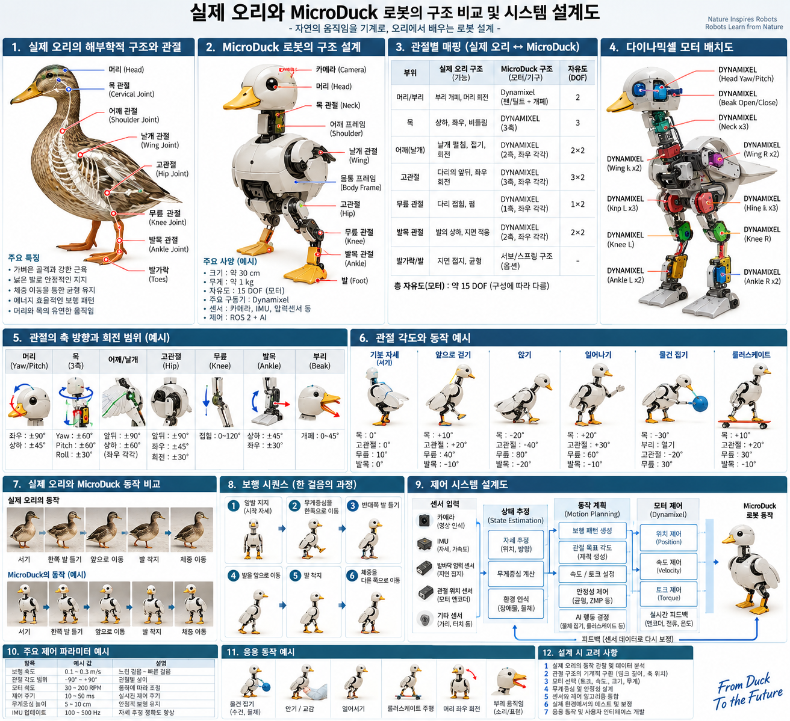
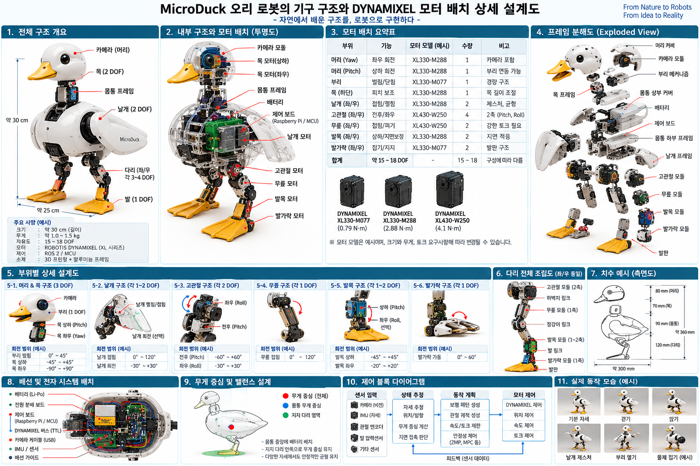
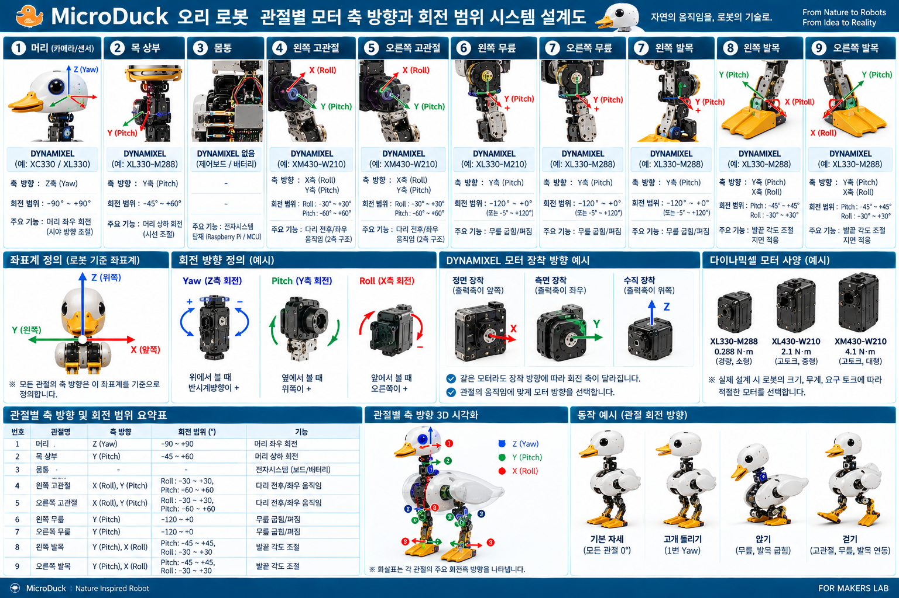
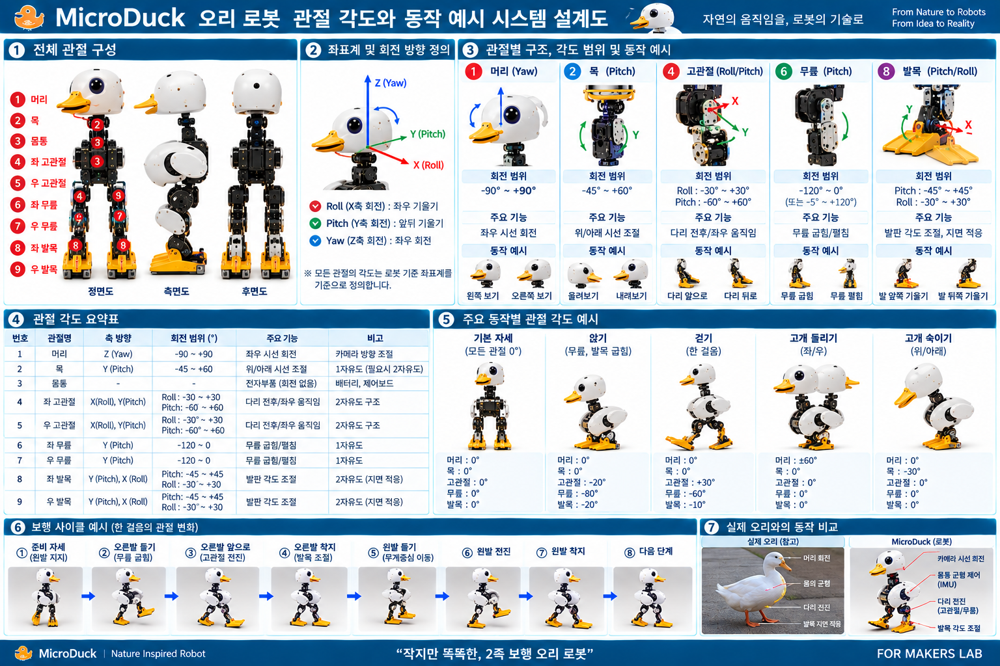
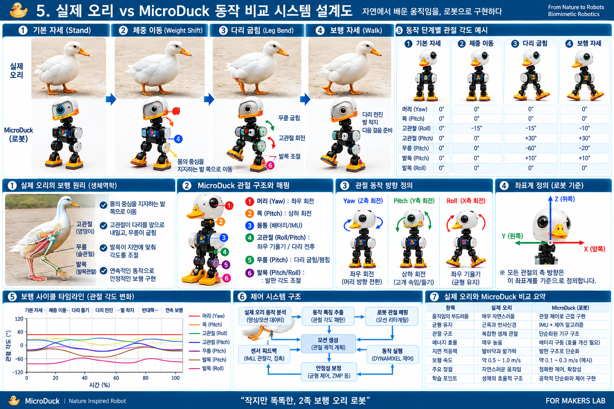
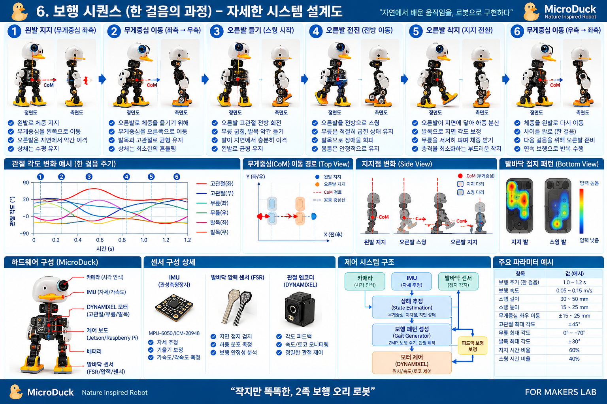
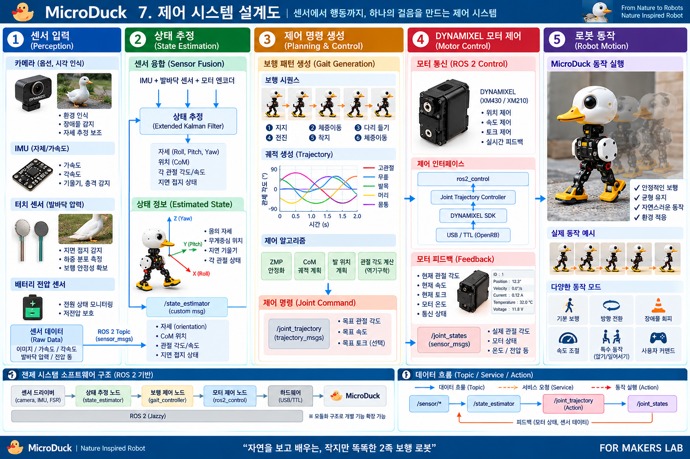
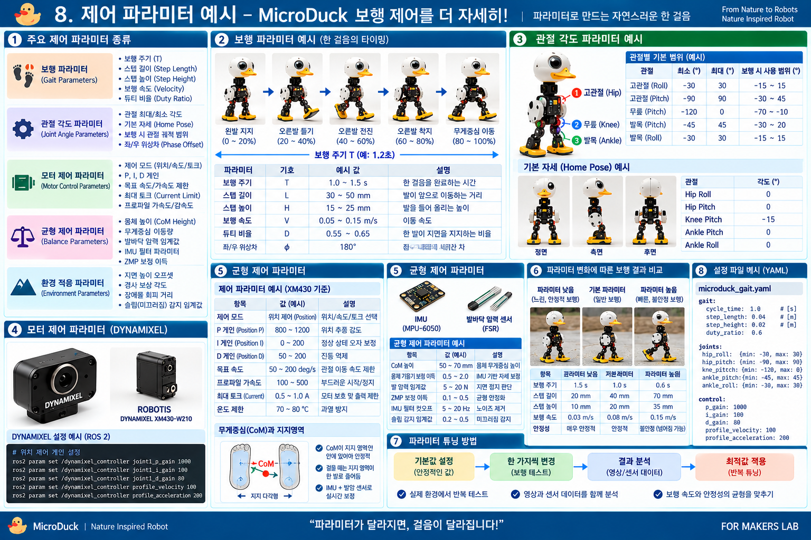
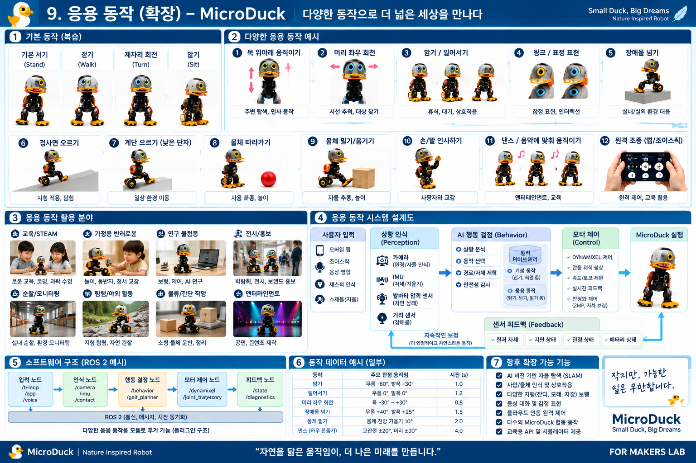

# MicroDuck를 통해 배우는 생체모방 오리 로봇 설계

## 실제 오리의 움직임에서 DYNAMIXEL, 보행 제어, Physical AI까지

FOR MAKERS LAB\
작성일: 이천이십육년 구월 오일

> 이 책은 유튜브 영상에서 진행한 MicroDuck 분석 대화를 바탕으로 정리한
> 메이커용 학습 자료입니다.\
> 그림 속 모터 수량, 관절 배치, 각도, 토크, 속도 등의 일부 값은 실제
> MicroDuck 공식 사양이 아니라 원리를 이해하기 위한 개념 예시입니다.
> 실제 제작에는 반드시 공식 하드웨어·소프트웨어 자료를 다시 확인해야
> 합니다.

------------------------------------------------------------------------

## 들어가며

MicroDuck을 단순히 귀여운 오리 로봇으로만 보면 재미있는 제품 하나로 끝날
수 있습니다. 하지만 메이커의 관점에서 보면 이야기가 달라집니다.

실제 오리는 어떻게 두 다리로 서고, 한쪽 발을 들고, 무게중심을 옮기며
걷는가? 그 움직임을 로봇의 링크와 관절로 바꾸려면 어디에 회전 중심을
두어야 하는가? 실제 오리의 근육 역할을 DYNAMIXEL 같은 스마트
액추에이터가 어떻게 대신할 수 있는가? 그리고 카메라, IMU, 엔코더, 제어
소프트웨어와 AI는 어떻게 연결되는가?

이 책은 바로 이 질문을 따라갑니다.

------------------------------------------------------------------------

# 일. 실제 오리와 MicroDuck 구조 비교

실제 오리에는 머리와 목, 몸통, 고관절, 무릎에 대응되는 다리 관절, 발목과
발이 있습니다. 생물의 관절은 뼈와 근육, 힘줄, 신경계가 함께 작동하기
때문에 로봇의 단순한 회전 관절보다 훨씬 복잡합니다.

따라서 로봇 설계에서 중요한 것은 실제 오리의 관절을 그대로 복제하는 것이
아닙니다. 오리가 어떤 목적을 위해 어떤 방향으로 움직이는지를 분석하고,
그 기능을 로봇의 제한된 자유도로 다시 표현하는 것입니다.

실제 오리마다 몸 크기와 다리 길이, 관절 위치가 다르고 성장하면서 신체
비율도 달라집니다. 반면 제작된 로봇의 링크 길이와 모터 축 위치는 대부분
고정됩니다. 따라서 실제 오리의 관절각을 그대로 복사하는 것보다 움직임의
의미를 로봇의 몸에 맞게 변환하는 과정이 중요합니다.

이 과정은 모션 리타게팅, 운동학적 매핑, 궤적 최적화 등으로 구현할 수
있으며, 모방학습이나 강화학습 같은 AI 기법을 결합할 수도 있습니다.

핵심 흐름은 다음과 같습니다.

실제 오리 영상 → 관절 포인트 추적 → 삼차원 자세 추정 → 움직임 특징 추출
→ MicroDuck 관절 매핑 → 모션 리타게팅 → 관절 궤적 생성 → 모터 명령 →
센서 피드백

------------------------------------------------------------------------

# 이. MicroDuck 기구 구조와 DYNAMIXEL 모터 배치

오리형 로봇을 실제로 만든다고 생각하면 가장 먼저 정해야 하는 것은 관절
중심과 자유도입니다.

고관절은 다리를 앞뒤로 보내기 위한 Pitch와 좌우 균형을 위한 Roll을
고려할 수 있습니다. 무릎은 주로 굽힘과 펴기를 담당하고, 발목은 지면에
발을 맞추고 균형을 보정합니다. 머리와 목에는 시선 방향을 바꾸기 위한
Yaw와 Pitch를 둘 수 있습니다.

여기에 DYNAMIXEL을 배치합니다. 중요한 것은 단순히 모터를 어느 위치에
넣느냐가 아니라 출력축을 어느 방향으로 놓느냐입니다. 같은 모터도 장착
방향이 바뀌면 관절의 운동 방향이 달라집니다.

모터 선정에서는 필요한 토크, 크기, 무게, 속도, 배선, 발열을 함께 봐야
합니다. 강한 모터를 무조건 많이 사용하면 다리가 무거워지고 상위 관절이
더 큰 토크를 요구하게 됩니다. 따라서 기구와 액추에이터, 배터리와 프레임,
무게중심은 서로 연결된 하나의 설계 문제입니다.

------------------------------------------------------------------------

# 삼. 관절별 모터 축 방향과 회전 범위

로봇의 움직임을 숫자로 표현하려면 먼저 좌표계를 정해야 합니다.
일반적으로 X축 회전을 Roll, Y축 회전을 Pitch, Z축 회전을 Yaw로 표현할 수
있습니다.

머리를 좌우로 돌리는 동작은 Yaw, 고개를 위아래로 움직이는 것은
Pitch입니다. 고관절은 Pitch와 Roll을 조합할 수 있고, 무릎은 주로 Pitch,
발목은 Pitch와 필요에 따라 Roll을 사용할 수 있습니다.

각 관절에는 영 도 기준, 플러스와 마이너스 방향, 최소각과 최대각이
필요합니다. 회전 범위를 벗어나면 프레임 충돌, 케이블 당김, 과도한 모터
부하가 발생할 수 있으므로 기계적 제한과 소프트웨어 제한을 함께 설계해야
합니다.

즉, 모터 축 방향은 움직임의 방향을 결정하고 회전 범위는 움직임의 한계를
결정합니다.

------------------------------------------------------------------------

# 사. 관절 각도와 동작 예시

하나의 자세는 여러 관절 각도의 조합입니다. 하나의 동작은 그 관절
각도들이 시간에 따라 연속적으로 변하는 과정입니다.

예를 들어 앉기 동작에서는 무릎만 굽히는 것이 아니라 고관절과 발목도 함께
움직여야 합니다. 걷기에서는 먼저 한쪽 발로 무게중심을 옮긴 뒤 반대쪽
다리를 들어 올리고, 고관절로 앞으로 보내며, 무릎과 발목을 조절해
착지합니다.

최종 목표각만 중요한 것도 아닙니다. 영 도에서 삼십 도까지 순간적으로
이동시키면 충격과 진동이 생길 수 있습니다. 따라서 속도와 가속도를 포함한
부드러운 궤적이 필요합니다.

------------------------------------------------------------------------

# 오. 실제 오리와 MicroDuck의 동작 비교

실제 오리의 동작을 로봇에 적용할 때 핵심은 자세 복사가 아니라 기능
매핑입니다.

실제 오리가 한쪽 발을 들기 전에 반대쪽으로 체중을 옮기는 이유는 지지발
위에 무게중심을 놓기 위해서입니다. MicroDuck도 똑같은 목적을 달성해야
하지만, 실제 오리와 동일한 관절각을 사용할 필요는 없습니다.

기본 자세 → 체중 이동 → 다리 굽힘 → 다리 전진 → 착지 → 반대쪽 체중
이동이라는 기능적 순서를 로봇의 고관절, 무릎, 발목 궤적으로 다시
만들어야 합니다.

실제 오리는 근육, 힘줄, 감각기관과 신경계를 이용해 지면 변화에
자연스럽게 대응합니다. 로봇에서는 DYNAMIXEL, IMU, 엔코더, 발 접촉 센서와
제어 알고리즘이 그 역할을 나누어 맡습니다.

------------------------------------------------------------------------

# 육. 보행 시퀀스 - 한 걸음이 만들어지는 과정

한 걸음을 여섯 단계로 단순화해 볼 수 있습니다.

먼저 왼발이 몸을 지지합니다. 그다음 오른발을 들 수 있도록 무게중심을
왼쪽 지지영역으로 이동합니다. 오른발을 들면서 무릎을 굽히고 발목을
조절합니다. 이후 고관절을 이용해 오른발을 앞으로 보내고, 발이 지면에
닿으면 충격을 분산시키며 체중을 오른쪽으로 넘깁니다. 마지막으로 반대쪽
다리가 같은 과정을 준비합니다.

이 과정에서 중요한 것은 무게중심 CoM과 지지영역입니다. 무게중심이
안정적으로 지지할 수 있는 영역을 벗어나면 로봇은 넘어질 가능성이
커집니다.

따라서 보행은 단순한 모터 재생이 아니라 관절 궤적, 몸체 자세, 발 접촉,
균형 보정이 동시에 작동하는 과정입니다.

------------------------------------------------------------------------

# 칠. 제어 시스템 설계

제어 시스템은 MicroDuck의 두뇌와 신경계에 해당합니다.

카메라는 주변 환경을 보고, IMU는 자세와 가속도 및 회전을 측정합니다.
발바닥 센서는 지면 접촉과 하중을 감지할 수 있고, 모터 엔코더는 현재 관절
위치를 알려줍니다.

이 센서 데이터를 융합해 현재 몸의 자세, 무게중심, 관절 상태와 지지
상태를 추정합니다. 그다음 보행 패턴과 목표 궤적을 생성하고, 각
DYNAMIXEL에 목표 위치, 속도, 필요하면 토크나 전류 제한을 전달합니다.

모터가 움직인 뒤에는 다시 엔코더와 IMU 등의 데이터를 읽습니다. 목표와
실제 상태의 차이가 있으면 다음 제어 주기에서 보정합니다.

센서 입력 → 상태 추정 → 행동 및 보행 계획 → 관절 궤적 → DYNAMIXEL 제어 →
실제 동작 → 센서 피드백

ROS 2를 사용한다면 센서 노드, 상태 추정 노드, 보행 제어 노드, 모터 제어
노드를 분리해 메시지와 액션으로 연결하는 구조를 생각할 수 있습니다. 이
구성은 개념 예시이며 실제 MicroDuck 공식 ROS 2 아키텍처를 의미하지는
않습니다.

------------------------------------------------------------------------

# 팔. 제어 파라미터와 튜닝

같은 기구와 같은 모터를 사용하더라도 제어 파라미터가 달라지면 움직임은
크게 달라집니다.

대표적인 보행 파라미터는 한 걸음의 주기, 보폭, 발을 들어 올리는 높이,
이동 속도와 지지 시간 비율입니다. 관절에는 최소각과 최대각, 기본 자세와
좌우 오프셋이 있습니다.

모터 제어에서는 위치와 속도, 가속과 감속 프로파일, 전류 또는 토크 제한,
제어 게인 등을 조정합니다. 균형 제어에서는 무게중심 높이, 몸체 기울기
허용량, IMU 필터와 보정 이득, 발 접촉 임계값 등을 생각할 수 있습니다.

좋은 튜닝 방법은 한꺼번에 모든 값을 바꾸지 않는 것입니다. 안정적인
기본값에서 한 가지 파라미터만 변경하고, 영상과 센서 로그를 함께 분석한
뒤 다시 조정합니다.

기본 설정 → 한 가지 값 변경 → 보행 테스트 → 영상·센서 데이터 분석 → 결과
비교 → 최적값 적용 → 반복

AI나 최적화 알고리즘을 사용하면 많은 파라미터 조합을 시뮬레이션에서
탐색하고 실제 로봇에 옮기는 방법도 가능합니다.

------------------------------------------------------------------------

# 구. 응용 동작과 확장 가능성

기본 서기와 걷기가 안정되면 로봇의 행동은 크게 확장될 수 있습니다.

머리 상하 움직임과 좌우 회전, 앉기와 일어서기, 방향 전환, 장애물 넘기,
낮은 단차 오르기, 물체 따라가기, 물체 밀기, 사용자에게 인사하기, 음악에
맞춘 동작, 원격 조종 등을 생각할 수 있습니다.

응용 시스템은 사용자 입력, 환경 인식, 행동 결정, 관절 궤적 생성, 모터
제어, 센서 피드백이라는 구조로 확장할 수 있습니다.

예를 들어 카메라가 목표물을 발견하면 비전 시스템이 위치를 추정하고, 행동
결정기가 회전 또는 보행을 선택하며, 보행 제어기가 관절 궤적을 만들고
DYNAMIXEL이 이를 실행합니다. 실제 움직임 결과는 다시 센서로 돌아와 다음
판단에 사용됩니다.

기본 동작을 모듈화하면 걷기, 회전, 앉기, 일어서기, 고개 돌리기, 장애물
넘기 같은 행동을 동작 라이브러리로 만들 수 있습니다. 상위 행동 제어기는
상황에 따라 이 동작들을 선택하고 연결합니다.

------------------------------------------------------------------------

# 십. 실제 오리의 움직임을 로봇이 학습할 수 있을까?

가능합니다. 다만 실제 오리의 관절각을 그대로 복사하는 문제로 보면 안
됩니다.

여러 오리의 영상을 수집하고 관절 포인트와 몸체 자세를 추적한 뒤, 몸
크기와 링크 길이가 다른 데이터를 정규화할 수 있습니다. 이후 체중 이동,
발 들기, 스윙, 착지 같은 공통 동작 특징을 추출합니다.

그 특징을 MicroDuck의 고정된 기구 구조와 관절 한계에 맞게 변환하는 것이
핵심입니다.

실제 오리 데이터 → 동작 특징 → 정규화 → 로봇 신체 모델 → 모션 리타게팅 →
시뮬레이션 → 학습·최적화 → 실제 로봇 → 피드백 데이터

모방학습에서는 실제 오리의 움직임을 참조 동작으로 사용할 수 있습니다.
강화학습에서는 넘어지지 않기, 목표 방향으로 이동하기, 참조 자세와
비슷하게 움직이기, 에너지 사용 줄이기 같은 보상을 설계할 수 있습니다.

결국 목표는 오리의 몸을 그대로 복사하는 것이 아니라 오리가 움직이는
원리를 학습해서 다른 몸을 가진 로봇이 실행할 수 있도록 번역하는
것입니다.

------------------------------------------------------------------------

# 십일. 메이커가 직접 시작한다면

처음부터 완성형 오리 로봇을 만들 필요는 없습니다.

관절 하나와 DYNAMIXEL 하나로 시작할 수 있습니다. 영 도를 정하고 십 도,
이십 도씩 움직여봅니다. 두 번째 관절을 추가해 두 관절을 동시에
움직여봅니다. 그다음 다리 하나를 만들고, 좌우 다리를 구성하고, IMU를
추가해 기울기를 측정합니다.

이후 카메라와 ROS 2, 보행 제어, 데이터 기록, 시뮬레이션과 AI를 하나씩
붙여갈 수 있습니다.

관절 하나 → 다리 하나 → 두 다리 → 몸통 → IMU → 보행 → 카메라 → 환경 인식
→ AI 행동 제어

로봇을 하나의 거대한 기술로 보면 어렵지만 작은 시스템으로 분해하면
충분히 연구하고 제작해볼 수 있습니다.

------------------------------------------------------------------------

# 맺음말 - 작은 움직임 하나에서 시작하는 로봇

MicroDuck을 공부하면서 가장 중요한 것은 완제품을 그대로 복제하는 것이
아닙니다.

자연을 관찰하고, 구조를 분석하고, 관절의 중심을 찾고, 회전축을 정의하고,
액추에이터를 선택하고, 직접 프레임을 만들고, 코드를 작성하고,
움직여보고, 실패하면 데이터를 확인해서 다시 수정하는 과정이 중요합니다.

DYNAMIXEL 같은 스마트 액추에이터와 삼차원 프린터, CAD, ROS 2, 카메라와
AI를 이용하면 개인 메이커도 예전보다 훨씬 다양한 로봇 연구를 시작할 수
있습니다.

"내가 로봇을 만들 수 있을까?"라고 생각하기보다 "오늘 관절 하나를 어떻게
움직여볼까?"에서 시작해보면 좋겠습니다.

관절 하나가 두 개가 되고, 다리가 되고, 몸이 되고, 센서와 소프트웨어가
연결되면서 어느 순간 하나의 로봇이 됩니다.

작게 시작해도 됩니다. 넘어지면 다시 세우고, 각도를 바꾸고, 다시 실험하면
됩니다.

그 작은 움직임 하나가 언젠가는 나만의 로봇이 될 수 있습니다.

------------------------------------------------------------------------

## 프로젝트 사용 안내

이 자료는 교육, 메이커 연구, 유튜브 영상 보조자료와 개인 프로젝트 설계
참고용으로 구성했습니다.

그림에 포함된 MicroDuck 형상, 관절 번호, DYNAMIXEL 모델, 회전 범위,
제어값 등은 설명을 위한 개념적 시각화가 포함되어 있습니다. 실제 제품을
제작하거나 개조할 때에는 해당 로봇과 액추에이터의 공식 문서, 전기적
사양, 기계적 한계와 안전 조건을 확인하십시오.

FOR MAKERS LAB
