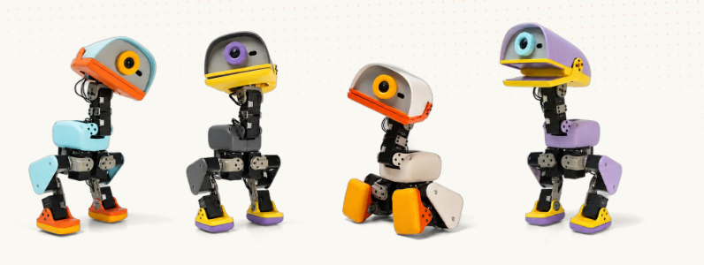
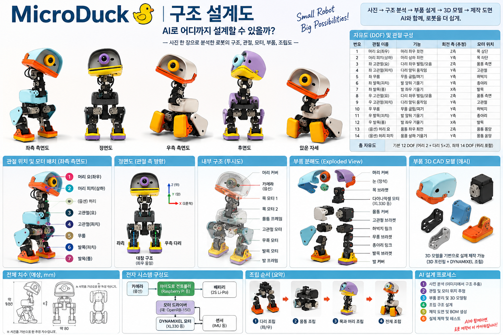
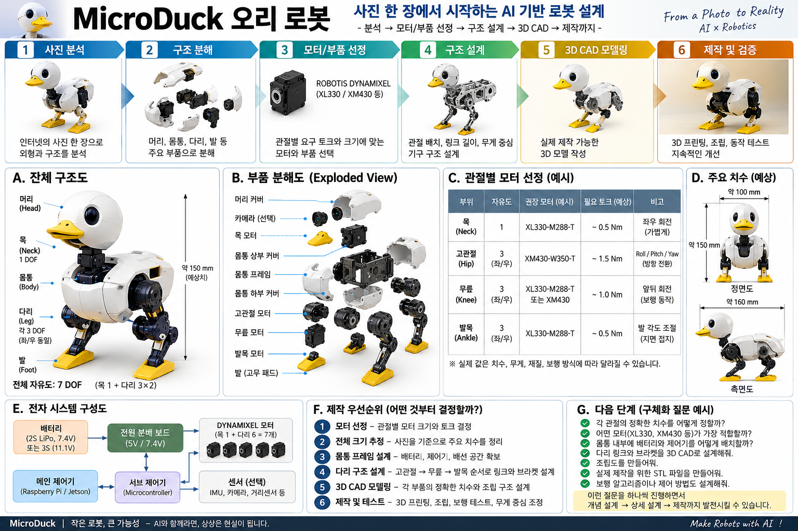
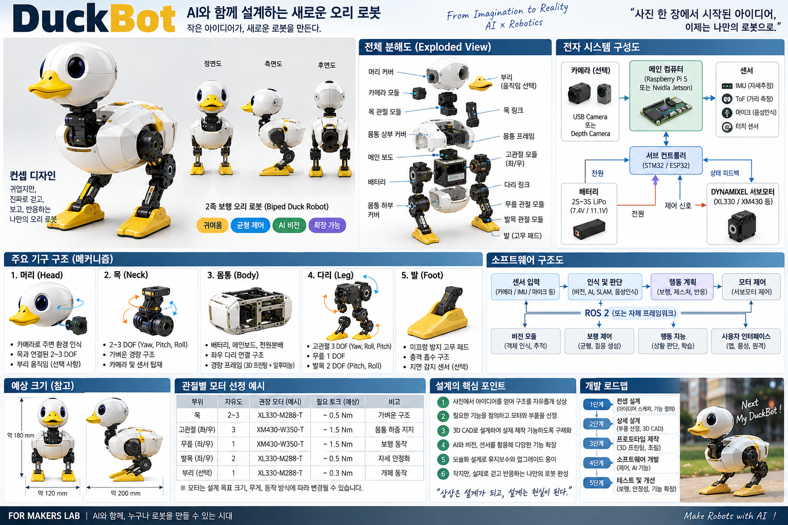
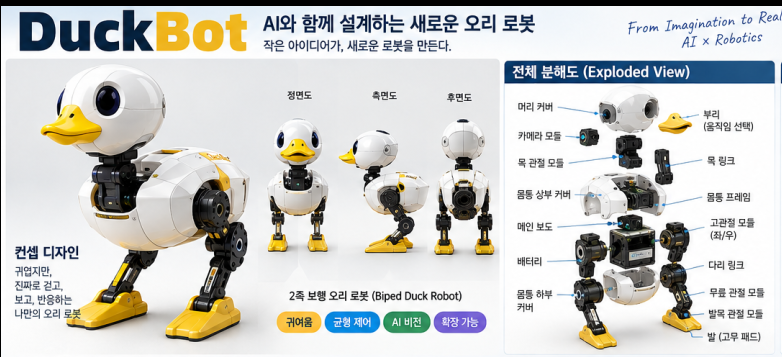
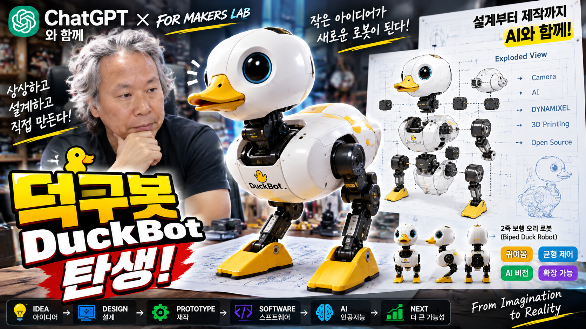

# AI로 어디까지 로봇을 설계할 수 있을까?
## MicroDuck에서 덕구봇(DuckBot)까지

### FOR MAKERS LAB · 2026-09-06

---

## 1. 시작: 사진 한 장에서 로봇 설계로

오늘의 질문은 단순했습니다.

> AI를 이용하면 로봇을 어디까지 설계할 수 있을까?

MicroDuck의 여러 자세가 담긴 이미지를 출발점으로 삼았습니다. 정확한 내부 치수와 모든 부품 스펙을 모르는 상태에서도 AI를 이용해 외형을 구조적으로 분해하고, 관절 위치와 모터 배치, 링크와 프레임, 전자 시스템과 소프트웨어 구조까지 단계적으로 시각화해 보기로 했습니다.

---

## 2. 구조 분석: 외형보다 먼저 관절을 본다

로봇을 설계할 때 가장 먼저 해야 할 일은 예쁜 외형을 따라 그리는 것이 아닙니다. 중요한 것은 **어디가 움직이는지**, **어떤 축으로 회전하는지**, **그 움직임을 어떤 모터가 만드는지**, 그리고 **각 부품이 어떻게 연결되는지**를 파악하는 것입니다.

MicroDuck을 머리, 목, 몸통, 좌우 다리, 발로 나누고 다음과 같은 순서로 분석했습니다.

1. 큰 부품 영역 분리
2. 관절 중심 추정
3. 모터 위치 추정
4. 링크와 브라켓 구조 추정
5. 자유도(DOF) 구성
6. 전체 로봇 골격 설계

이 단계의 도면은 최종 제작도가 아니라 **개념 설계도**입니다. 실제 제작을 위해서는 치수, 토크, 체결 위치, 배선 공간, 부품 간 간섭 등을 검증해야 합니다.

---

## 3. AI 도면을 보는 방법: 오류보다 시스템 흐름

AI가 만든 초기 도면에는 실제 로봇과 다른 표현이 나타날 수 있습니다. 예를 들어 이족 로봇이 일부 분해도에서 4족처럼 표현될 수도 있습니다.

하지만 이 과정에서 중요한 것은 글자 하나, 부품 하나의 완벽한 정답보다도 **전체 시스템을 빠르게 이해하는 것**입니다. 새로운 도면을 보면서 “이런 구조도 가능하구나”, “모터와 링크가 이런 관계구나”, “전자 시스템은 이렇게 구성할 수 있구나”를 빠르게 습득할 수 있다는 점이 큰 장점입니다.

---

## 4. 실제 제작으로 가려면 무엇을 먼저 결정해야 하나?

사진만 있고 정확한 스펙이 없다면 다음 순서가 좋습니다.

### 4.1 필요한 움직임 정의

먼저 로봇이 무엇을 해야 하는지 정합니다. 머리를 좌우로 돌릴 것인지, 두 다리로 균형을 잡을 것인지, 발목으로 지면에 대응할 것인지가 관절 수를 결정합니다.

### 4.2 관절축과 자유도 정의

각 관절이 Yaw, Pitch, Roll 중 어떤 축으로 움직여야 하는지 정합니다.

### 4.3 예상 하중과 모터 선정

하중을 많이 받는 고관절과 무릎에는 큰 토크가 필요하고, 머리나 부리처럼 가벼운 부위에는 더 작고 가벼운 모터를 사용할 수 있습니다. 로봇 크기가 커질수록 관절별 모터 차이는 더 중요해집니다.

### 4.4 링크와 브라켓 설계

모터를 정하면 모터 크기에 맞춰 링크 길이, 브라켓 형태, 체결 구멍, 케이블 경로를 설계합니다.

### 4.5 전원과 제어부

배터리, 전원 분배, 메인 컴퓨터, 서브 컨트롤러, 센서, 모터 통신 구조를 정합니다.

---

## 5. 새로운 상상: MicroDuck을 넘어 덕구봇으로

여기서 방향을 바꿨습니다. 기존 MicroDuck을 그대로 복제하는 것이 아니라, 그 분석 과정에서 얻은 아이디어를 바탕으로 **완전히 새로운 오리 로봇**을 상상했습니다.

그 이름이 바로 **덕구봇(DuckBot)** 입니다.

덕구봇은 귀여운 외형을 유지하면서 내부는 모듈식으로 설계하는 이족 오리 로봇입니다.

- 머리 모듈
- 목 모듈
- 몸통 프레임
- 좌우 고관절 모듈
- 다리 링크
- 무릎 관절
- 발목 관절
- 발/고무 패드
- 카메라와 센서
- 메인 컴퓨터
- 서브 컨트롤러
- DYNAMIXEL 계열 서보 모터

---

## 6. 덕구봇 기구 메커니즘

덕구봇을 처음부터 완벽한 로봇으로 만들 필요는 없습니다. 오히려 모듈 단위로 나누는 것이 중요합니다.

### 머리

카메라와 선택적인 부리 움직임을 포함합니다. 머리의 움직임은 비교적 가벼운 하중이므로 작은 서보로 시작할 수 있습니다.

### 목

Yaw/Pitch 중심의 1~3 DOF 구조를 생각할 수 있습니다. 처음에는 1 DOF부터 시작해도 충분합니다.

### 몸통

배터리, 메인보드, 전원 분배, 통신 보드가 들어가는 중심 프레임입니다. 무게 중심이 지나치게 위로 올라가지 않도록 배터리를 낮게 배치하는 것이 유리합니다.

### 다리

고관절, 무릎, 발목으로 이어지는 핵심 구조입니다. 몸의 하중을 받기 때문에 모터 토크와 구조 강성이 가장 중요합니다.

### 발

지면과 직접 접촉하므로 넓이, 마찰, 충격 흡수, 발목 자유도 등이 균형에 큰 영향을 줍니다.

---

## 7. 전자 시스템 구조

덕구봇의 전자 시스템은 다음과 같은 흐름으로 생각할 수 있습니다.

**센서 → 메인 컴퓨터 → 서브 컨트롤러 → DYNAMIXEL 모터 → 상태 피드백**

### 센서

- USB 카메라 또는 Depth 카메라
- IMU
- 거리 센서(ToF)
- 마이크
- 선택적 터치 센서

### 메인 컴퓨터

Raspberry Pi 5 또는 NVIDIA Jetson 계열을 예로 들 수 있습니다. 비전, AI 추론, 행동 판단, 사용자 인터페이스를 담당합니다.

### 서브 컨트롤러

STM32, ESP32 또는 전용 모터 제어 보드 등을 사용할 수 있습니다. 실시간성이 필요한 모터 명령과 센서 I/O를 처리합니다.

### 모터

DYNAMIXEL XL330, XM/XW 계열 등 크기와 토크가 다른 제품을 관절별로 선택할 수 있습니다. 실제 선정은 로봇 크기와 질량, 링크 길이, 목표 속도에 따라 다시 계산해야 합니다.

---

## 8. 소프트웨어 구조

덕구봇의 소프트웨어는 다음 흐름으로 정리할 수 있습니다.

**센서 입력 → 인식 및 판단 → 행동 계획 → 모터 제어**

이를 기능 모듈로 나누면 다음과 같습니다.

- 비전 모듈: 객체 인식, 추적
- 보행 제어: 균형, 걸음 생성
- 행동 지능: 상황 판단, 행동 선택
- 사용자 인터페이스: 앱, 음성, 원격 제어
- 모터 제어: 위치/속도/토크 명령

ROS 2를 기반으로 각 모듈을 분리하면 기능을 하나씩 추가하기 좋습니다.

---

## 9. 개발 로드맵

오늘 가장 중요한 결론 중 하나는 **처음부터 로봇 전체를 만들 필요가 없다는 것**입니다.

### 1단계 — 콘셉트 설계

아이디어와 기능을 정합니다.

### 2단계 — 상세 설계

관절 하나를 기준으로 모터, 링크, 브라켓을 설계합니다.

### 3단계 — 프로토타입 제작

3D 프린터로 간단한 링크를 출력하고 모터 하나를 실제로 움직입니다.

### 4단계 — 소프트웨어 개발

모터 제어, 센서 읽기, 간단한 명령부터 시작합니다.

### 5단계 — 테스트와 개선

움직여보고, 실패하고, 다시 설계합니다.

그다음 모터를 하나에서 두 개, 두 개에서 세 개, 네 개, 다섯 개로 늘립니다. 관절 하나가 다리 하나가 되고, 다리 하나가 몸통과 연결되면서 로봇 전체로 발전합니다.

---

## 10. 작은 성공을 반복한다

처음 로봇을 만드는 사람에게 가장 중요한 것은 거대한 완성품을 상상하는 것이 아니라 **아주 작은 동작 하나를 실제로 성공시키는 것**입니다.

오늘은 모터 하나.

다음에는 관절 하나.

그다음에는 다리 하나.

그리고 언젠가는 두 발로 서 있는 덕구봇.

AI는 완성된 정답을 대신 만들어주는 도구라기보다, 아이디어를 시각화하고 모르는 부분을 질문하며 빠르게 배우고 반복할 수 있게 해주는 파트너에 가깝습니다.

---

## 11. 오늘의 결과: 덕구봇 탄생

오늘은 MicroDuck의 사진과 구조를 보면서 시작했습니다. 하지만 구조도, 분해도, 모터, 전자 시스템, 소프트웨어를 하나씩 대화하며 발전시키다 보니 결국 새로운 로봇 콘셉트가 탄생했습니다.

**덕구봇(DuckBot)**.

오늘은 그림이지만 첫 번째 모터를 움직이는 순간부터 실제 프로젝트가 됩니다.

> AI와 함께 상상하고, 설계하고, 직접 만들어보는 로봇. 덕구봇 프로젝트, 이제 시작입니다.

---

## 12. 영상 썸네일

---

## 다음 편 제안

다음 편에서는 덕구봇을 실제 제작 단계로 옮겨 다음 중 하나를 진행할 수 있습니다.

1. 목 관절 1 DOF 프로토타입
2. DYNAMIXEL 모터 1개 + 3D 프린팅 링크
3. 다리 1개 기구 설계
4. 모터 2~3개 연동
5. 카메라 + 목 추적 기능
6. 좌우 다리 기반 균형 테스트

