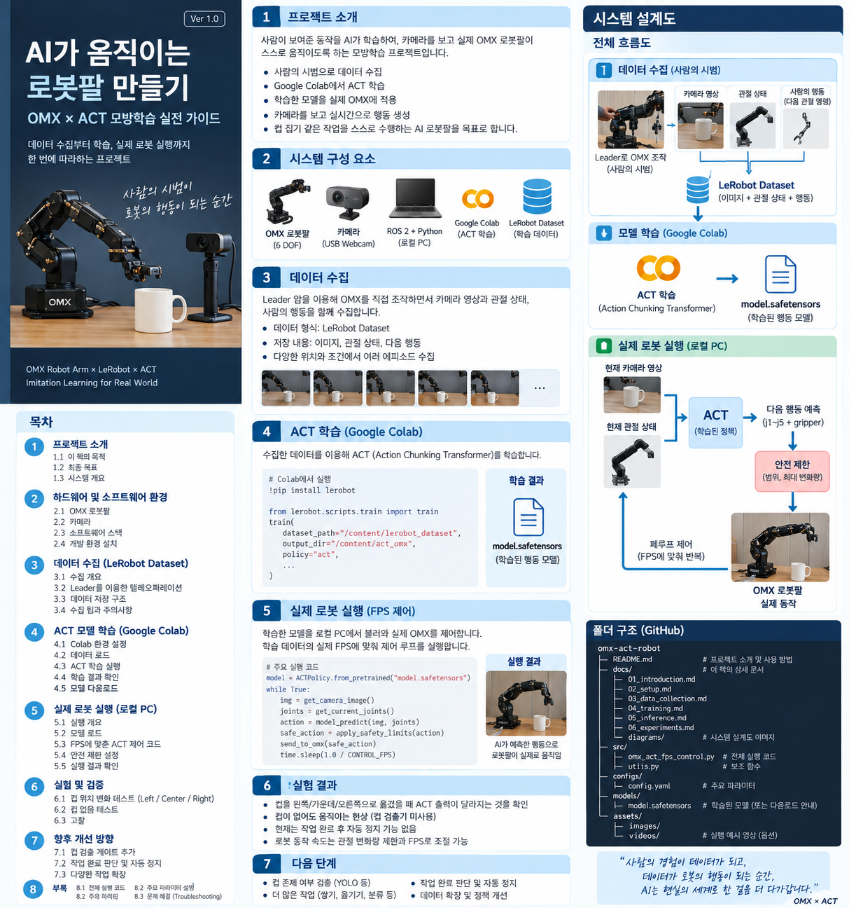

# OMX × ACT 모방학습 실전 프로젝트

Google Colab에서 LeRobot ACT(Action Chunking Transformer)로 학습한 정책을 로컬 Ubuntu/ROS 2 Jazzy 환경으로 가져와 ROBOTIS OMX 로봇팔에 연결한 실험 기록입니다.

## 오늘 확인한 것

- `model.safetensors` ACT 정책 로딩 성공
- 입력: `observation.state` 6차원 + RGB `3×480×640`
- 출력: `action` 6차원
- Orbbec RGB `/camera/color/image_raw` 연결
- OMX `/joint_states` 연결
- 실제 ARM/Gripper 명령 전송
- 컵 Left / Center / Right 위치별 ACT 출력 비교
- 학습 데이터 FPS에 맞추기 위한 closed-loop 실행 코드 작성



## 빠른 실행

> 실제 로봇이 움직입니다. 주변을 비우고 비상 정지할 수 있는 상태에서 실행하세요.

```bash
source ~/Robotics/ros2_ws/install/setup.bash
source ~/omx_ai_venv/bin/activate
cd ~/Downloads/pretrained_model/pretrained_model
python /path/to/scripts/omx_act_fps_control.py
```

진단만 할 때는 로봇 명령을 보내지 않는 다음 코드를 사용합니다.

```bash
python /path/to/scripts/omx_act_cup_test.py
```

자세한 과정은 [BOOK.md](BOOK.md), 파일 설명은 [PROJECT_FILES.md](PROJECT_FILES.md)를 참고하세요.

## 모델 파일

대용량 `model.safetensors` 자체는 이 배포 ZIP에 포함하지 않았습니다. 기존 학습 모델 디렉터리의 다음 파일들을 사용합니다.

- `config.json`
- `model.safetensors`
- `policy_preprocessor.json`
- `policy_preprocessor_step_3_normalizer_processor.safetensors`
- `policy_postprocessor.json`
- `policy_postprocessor_step_0_unnormalizer_processor.safetensors`
- `train_config.json`

`pretrained_model/README.md`에 배치 방법을 적었습니다.
