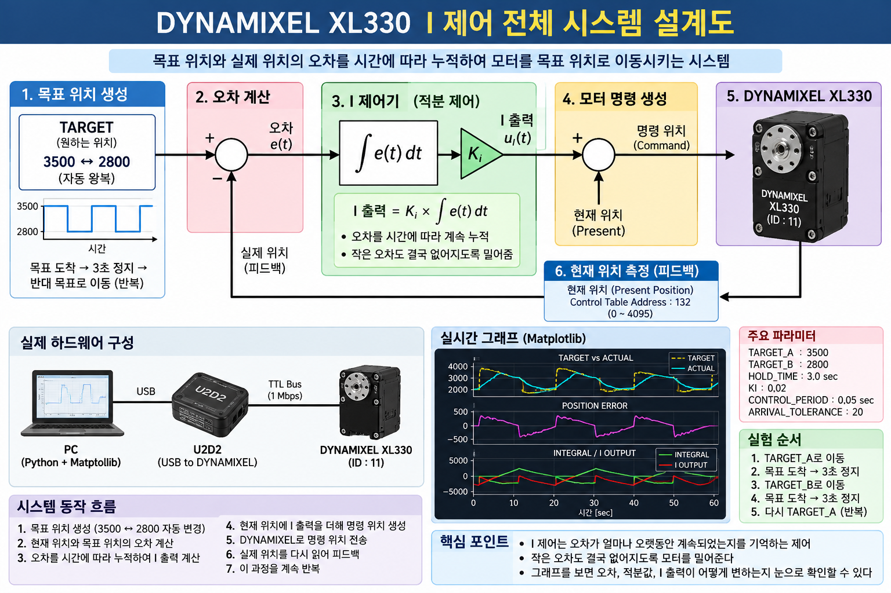
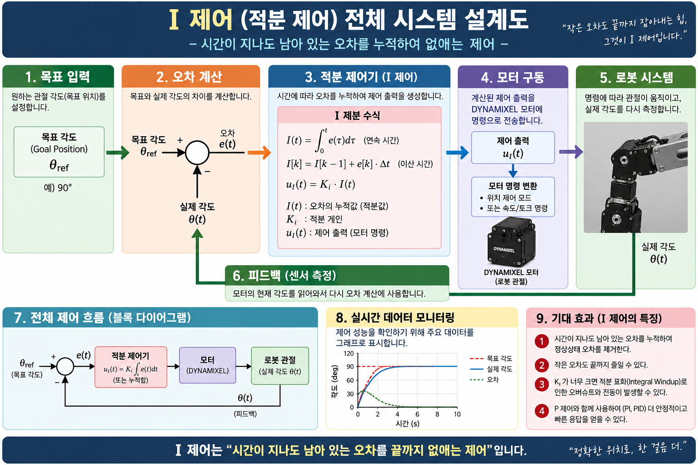

# DYNAMIXEL XL330으로 배우는 I 제어

> 적분 제어의 기초부터 Python 실험, 실시간 그래프, CSV 기록까지



## 개요

이 자료는 DYNAMIXEL XL330과 U2D2를 이용해 I 제어를 실제 모터에 적용하고,
반복 왕복 운동과 실시간 그래프 및 CSV 기록까지 수행하는 학습 자료입니다.

## 핵심 공식

-   `Error = Target - Actual`
-   `Integral = Integral + Error × dt`
-   `I Output = Ki × Integral`

## 실험 환경

-   Ubuntu
-   Python 3
-   U2D2
-   DYNAMIXEL XL330
-   `/dev/ttyUSB0`
-   Baudrate: `1000000`
-   DXL ID: `11`
-   Target: `3500 ↔ 2800`

## 빠른 실행

``` bash
python3 -m pip install dynamixel-sdk matplotlib
cd ~
python3 i_control_graph_test.py
```

## 실험 구조

`TARGET → ERROR → INTEGRAL → Ki → I OUTPUT → MOTOR COMMAND → XL330 → PRESENT POSITION → FEEDBACK`



## 그래프

1.  TARGET vs ACTUAL
2.  POSITION ERROR
3.  INTEGRAL / I OUTPUT

## 안전 및 해석 주의

이 코드는 XL330 내부 Position Mode 제어기 위에 교육용 외부 I 루프를
추가한 구조입니다. 순수한 저수준 I-only 모터 제어 실험과는 다릅니다.
처음에는 무부하에서 낮은 Ki로 시험하고 Goal Position은 0\~4095 범위를
벗어나지 않게 하십시오.

## 파일

-   `i_control_graph_test.py` : 전체 실험 코드
-   `images/` : 시스템 설계도
-   `DYNAMIXEL_XL330_I_Control_Book_2026-09-17.pdf` : 전체 책 PDF
